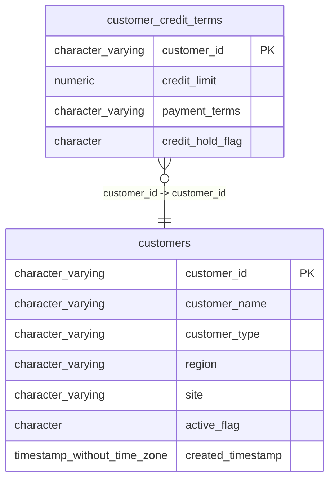

# customer_credit_terms

## Overview
The `customer_credit_terms` table stores credit-related information for customers, including credit limits, payment terms, and whether a credit hold is in effect. This data helps the business manage customer accounts and assess credit risk effectively. The presence of a foreign key constraint indicates that each customer record in this table relates to a unique customer entry in the `customers` table.

## Entity Relationship Diagram


## Column Reference Table
| Column | Type | Nullable | Default | Description |
|---|---|---|---|---|
| customer_id | character varying(20) | No |  | Unique identifier for each customer. |
| credit_limit | numeric(12,2) | Yes |  | Maximum credit amount allowed for the customer. |
| payment_terms | character varying(30) | Yes |  | Agreed payment duration for customer invoices. |
| credit_hold_flag | character(1) | Yes | 'N'::bpchar | Indicates if customer credit is on hold. |

## Business Rules
The following check constraint is enforced at the database level:
- **customer_credit_terms_customer_id_not_null**: Ensures that the `customer_id` column cannot contain null values, thereby enforcing the requirement that every credit term record must be associated with a valid customer.

*Inferred rules based on sample data:*
- Credit limits appear to be specified as numeric values, indicating the amount of credit available to each customer.
- Payment terms are generally expressed in days (e.g., "Net 30," "Net 45"), suggesting a standard practice for payment periods.
- The `credit_hold_flag` is a single character, possibly designating whether a customer is currently on credit hold or not ('Y' for yes, 'N' for no).

## Common Query Examples
```sql
-- Retrieve all customer credit terms with limits greater than $30,000
SELECT * FROM customer_credit_terms WHERE credit_limit > 30000;
```

```sql
-- Count the number of customers on credit hold
SELECT COUNT(*) FROM customer_credit_terms WHERE credit_hold_flag = 'Y';
```

```sql
-- Get payment terms for a specific customer by customer_id
SELECT payment_terms FROM customer_credit_terms WHERE customer_id = 'C00101';
```

```sql
-- Update credit limit for a specific customer
UPDATE customer_credit_terms SET credit_limit = '28000.00' WHERE customer_id = 'C00102';
```

## Index Documentation
The following index is defined for the `customer_credit_terms` table:
- **customer_credit_terms_pkey**: Unique, primary key index on the `customer_id` column.

No additional indexes are defined. However, it might be beneficial to create the following indexes:
- An index on the `credit_hold_flag` column to improve lookup performance for queries related to customers' credit status.
- An index on the `credit_limit` column to optimize queries that filter or sort results based on credit limits.

## Migration History
This database has no migration-tracking table (checked for alembic, flyway, django, knex, and sequelize conventions). Schema changes here are not currently tracked.

## Related
- [[relationships/customer_credit_terms-customers]]
- [[relationships/overview]]
- [[domains/customer-management]]
- [[enums/credit_hold_flag]]
- [[queries/customers-credit-holds]] — Customers with outstanding credit holds
- [[queries/customer-credit-terms-purchase-orders]] — Customer credit terms associated with purchase orders
- [[queries/customer-credit-terms-sales-orders]] — Customer credit terms to sales orders
- [[queries/credit-terms-customer-regions]] — Credit terms and customer regions
- [[queries/customer-credit-site-vendor-assignments]] — Customer Credit Terms to Site Vendor Assignments
- [[erd]]
- [[overview]]
- [[index]]
