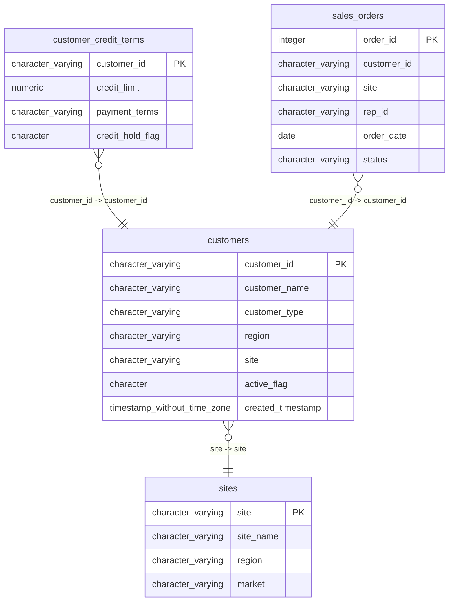

# customers

## Overview
The "customers" table captures information about various customer entities, allowing a business to manage and analyze its customer base effectively. It includes details such as customer identifiers, names, types, active status, and related site information. The sample data suggests the table supports diverse types of customers, ranging from independent businesses to institutional entities.

## Entity Relationship Diagram


## Column Reference Table
| Column | Type | Nullable | Default | Description |
|---|---|---|---|---|
| customer_id | character varying(20) | No |  | Unique identifier for each customer |
| customer_name | character varying(100) | No |  | Name of the customer or organization |
| customer_type | character varying(30) | Yes |  | Type or category of the customer |
| region | character varying(50) | Yes |  | Geographical region where the customer is located |
| site | character varying(10) | Yes |  | Location code of the customer's site |
| active_flag | character(1) | Yes | 'Y'::bpchar | Indicates if the customer is currently active |
| created_timestamp | timestamp without time zone | Yes | now() | Date and time when the customer record was created |

## Business Rules
The following check constraints are enforced at the database level:
- The constraint `customers_customer_id_not_null` ensures that the `customer_id` column must not contain null values.
- The constraint `customers_customer_name_not_null` ensures that the `customer_name` column must not contain null values.

*Inferred rules based on sample data:*
- All customer IDs seem to be unique and follow the pattern "CXXXXX".
- The `active_flag` contains only "Y" or potentially "N" values, indicating whether a customer is currently active.
- The `customer_type` field provides various categorizations of customers, which can aid in reporting and analysis.
- The `region` field reflects geographical segments that could be significant for business operations and marketing.

## Common Query Examples
```sql
-- Retrieve all active customers in the Southeast region
SELECT * FROM customers
WHERE active_flag = 'Y' AND region = 'Southeast';
```

```sql
-- Count the number of customers by customer type
SELECT customer_type, COUNT(*) AS customer_count FROM customers
GROUP BY customer_type;
```

```sql
-- Find customers created after a specific timestamp
SELECT * FROM customers
WHERE created_timestamp > '2026-01-01 00:00:00';
```

```sql
-- Get customer names and their corresponding IDs for all active customers
SELECT customer_id, customer_name FROM customers
WHERE active_flag = 'Y';
```

## Index Documentation
The following index is available on the "customers" table:
- **customers_pkey**: This is a unique, primary index on the `customer_id` column.

If there were no indexes, it can be suggested to create indexes on:
- `active_flag` for quicker filtering of active customers.
- `region` to speed up queries that segment customers based on geographical locations.

## Migration History
This database has no migration-tracking table (checked for alembic, flyway, django, knex, and sequelize conventions). Schema changes here are not currently tracked.

## Related
- [[relationships/customer_credit_terms-customers]]
- [[relationships/customers-sites]]
- [[relationships/sales_orders-customers]]
- [[relationships/overview]]
- [[domains/customer-management]]
- [[enums/customer_type]]
- [[enums/site]]
- [[enums/active_flag]]
- [[queries/customers-credit-holds]] — Customers with outstanding credit holds
- [[queries/customer-credit-terms-purchase-orders]] — Customer credit terms associated with purchase orders
- [[queries/customer-credit-terms-sales-orders]] — Customer credit terms to sales orders
- [[queries/credit-terms-customer-regions]] — Credit terms and customer regions
- [[queries/growth-opportunity-customers-sites]] — Growth Opportunity Events related to Customers through Sites
- [[queries/customer-credit-site-vendor-assignments]] — Customer Credit Terms to Site Vendor Assignments
- [[queries/customer-sales-orders]] — Customer Sales Order Details
- [[erd]]
- [[overview]]
- [[index]]
