# growth_opportunity_event

## Overview
The `growth_opportunity_event` table is designed to track various events related to growth opportunities within a supply chain context. This could involve vendor changes, price adjustments, or item conversions. The columns provide detailed information about vendors, items, pricing, and logistical considerations, helping to support decision-making processes in inventory and supplier management.

## Entity Relationship Diagram

```mermaid
erDiagram
    growth_opportunity_event {
        character_varying event_id
        character_varying site
        character_varying true_vendor
        character_varying true_vendor_ship_point
        character_varying true_vendor_name
        character_varying source_vendor
        character_varying source_vendor_ship_point
        character_varying source_vendor_group
        character_varying source_vendor_name
        character_varying pay_to_vendor
        character_varying order_group_id
        character_varying freight_vendor
        character cmi
        character_varying buyer
        character psa
        character_varying pricing_source_vendor
        numeric rme_price_pt
        character active_stock
        character_varying demand_status
        character non_stock
        character remote
        character inactive
        character proprietary
        integer site_count_for_suvc
        integer site_count_for_suvc_sp
        numeric storage_code_split_c
        numeric storage_code_split_d
        numeric storage_code_split_f
        character_varying order_day_in_week
        character_varying common_mode
        character_varying temperature
        character_varying order_due_based_by
        character auto_approval
        integer days_to_pick
        integer quoted_lead_time
        integer default_lead_time
        integer theoretical_transit_time
        character fixed_review
        numeric curr_oc
        character build_to_max
        character_varying target_bracket
        character_varying target_unit
        numeric bracket_min
        numeric bracket_max
        numeric median_actual_lead_time
        numeric weekly_avg_purchase_order
        numeric avg_po_ordered_wgt
        numeric avg_po_rcvd_wgt
        numeric avg_po_ordered_cube
        numeric avg_po_received_cube
        numeric avg_po_ordered_case
        numeric avg_po_received_case
        integer sus_override_lead_time
        numeric weekly_usage
        character_varying initial
        character_varying item_no
        character_varying item_desc
        integer pack
        character_varying brand
        character_varying item_size
        character_varying site_supc
        numeric item_cost
        character_varying billing
        character ot4t
        text ai_summary
        text comments
        character_varying true_vendor_ship_from_suffix
        character_varying source_vendor_ship_from_suffix
        character_varying buying_group
        character item_catch_weight_ind
        integer buy_ti
        integer buy_hi
        integer shelf_life
        character_varying vendor_name
        timestamp_without_time_zone created_timestamp
        timestamp_without_time_zone updated_timestamp
        character_varying growth_opportunity_event_uuid
        character_varying event_type
        numeric vendor_price
        character_varying price_unit
        date price_effective_date
        numeric cube
        numeric net_weight
        numeric gross_weight
        date source_vendor_effective_date
        character_varying item_status
        date status_effective_date
        character_varying container
        integer master_case
        integer unit_per_case
        integer min_split
        character_varying item_storage
        character ship_split
        character proprietary_flag
        character_varying stock_type
        character_varying demand_status_code
        numeric vendor_min
        numeric vendor_max
        character_varying min_max_type
        character include_min_flag
        numeric buy_multiple
        character_varying buy_multiple_type
        integer cases_in_vendor_unit
        character_varying vendor_storage_type
        character consignment_item_flag
        integer sysco_ti
        integer sysco_hi
        integer sysco_shelf_life
        integer customer_shelf_life
        integer manufacturer_shelf_life
        date manufacturing_date
        date expiration_date
        character catch_weight_flag
        character item_update_flag
        numeric freight_rate
        character_varying freight_type
        date handling_effective_date
        date first_order_date
        character_varying weekly_usage_code
        text handling_notes
        character_varying region
        character_varying market
        character_varying rdc
        character_varying rme_cust_num
        character_varying prod_spclst
        character_varying buy_mltp_typ
        character_varying vendor_suvc
    }
    items {
        character_varying item_no PK
        character_varying item_desc
        character_varying brand
        character_varying item_size
        integer pack
    }
    sites {
        character_varying site PK
        character_varying site_name
        character_varying region
        character_varying market
    }
    source_vendors {
        character_varying source_vendor_id PK
        character_varying source_vendor_name
        character_varying source_vendor_group
        character_varying region
        timestamp_without_time_zone created_timestamp
    }
    vendors {
        character_varying vendor_id PK
        character_varying vendor_name
        character_varying vendor_type
        character active_flag
        date onboarded_date
        timestamp_without_time_zone created_timestamp
    }
    growth_opportunity_event }o--|| vendors : "true_vendor -> vendor_id"
    growth_opportunity_event }o--|| source_vendors : "source_vendor -> source_vendor_id"
    growth_opportunity_event }o--|| items : "item_no -> item_no"
    growth_opportunity_event }o--|| sites : "site -> site"
```


## Column Reference Table
| Column | Type | Nullable | Default | Description |
|---|---|---|---|---|
| event_id | character varying(50) | Yes |  | Unique identifier for each growth opportunity event. |
| site | character varying(10) | Yes |  | Code representing the specific site related to the event. |
| true_vendor | character varying(20) | Yes |  | Actual vendor providing the products. |
| true_vendor_ship_point | character varying(20) | Yes |  | Shipping point of the true vendor. |
| true_vendor_name | character varying(100) | Yes |  | Official name of the true vendor. |
| source_vendor | character varying(20) | Yes |  | Vendor supplying the products before the true vendor. |
| source_vendor_ship_point | character varying(20) | Yes |  | Shipping point of the source vendor. |
| source_vendor_group | character varying(50) | Yes |  | Group categorizing the source vendor. |
| source_vendor_name | character varying(100) | Yes |  | Official name of the source vendor. |
| pay_to_vendor | character varying(20) | Yes |  | Identifier for the vendor receiving payments. |
| order_group_id | character varying(20) | Yes |  | ID categorizing the group of orders. |
| freight_vendor | character varying(20) | Yes |  | Vendor responsible for transportation and shipping. |
| cmi | character(1) | Yes |  | Customer Managed Inventory indicator. |
| buyer | character varying(50) | Yes |  | Individual responsible for purchasing decisions. |
| psa | character(1) | Yes |  | Product Service Agreement indicator. |
| pricing_source_vendor | character varying(20) | Yes |  | Vendor associated with pricing details. |
| rme_price_pt | numeric(10,2) | Yes |  | Price point set by the RME for purchasing. |
| active_stock | character(1) | Yes |  | Indicates if stock is active and available. |
| demand_status | character varying(20) | Yes |  | Current status of demand for the item. |
| non_stock | character(1) | Yes |  | Indicates if the item is non-stocked in the inventory. |
| remote | character(1) | Yes |  | Indicates if the operation is remote or not. |
| inactive | character(1) | Yes |  | Status showing if the item is inactive. |
| proprietary | character(1) | Yes |  | Indicates if the item is a proprietary product. |
| site_count_for_suvc | integer | Yes |  | Count of sites using the specific vendor service unit. |
| site_count_for_suvc_sp | integer | Yes |  | Count of sites specific to the shipping point. |
| storage_code_split_c | numeric(5,2) | Yes |  | Percentage allocation for storage category 'C'. |
| storage_code_split_d | numeric(5,2) | Yes |  | Percentage allocation for storage category 'D'. |
| storage_code_split_f | numeric(5,2) | Yes |  | Percentage allocation for storage category 'F'. |
| order_day_in_week | character varying(10) | Yes |  | Preferred day of the week for placing orders. |
| common_mode | character varying(20) | Yes |  | Standard method of operation for the item. |
| temperature | character varying(20) | Yes |  | Recommended storage temperature for the product. |
| order_due_based_by | character varying(20) | Yes |  | Reference point for determining order due dates. |
| auto_approval | character(1) | Yes |  | Indicates if orders require automatic approval. |
| days_to_pick | integer | Yes |  | Number of days required to prepare an order. |
| quoted_lead_time | integer | Yes |  | Time quoted for delivering the items. |
| default_lead_time | integer | Yes |  | Standard lead time for order fulfillment. |
| theoretical_transit_time | integer | Yes |  | Estimated time for transportation of items. |
| fixed_review | character(1) | Yes |  | Indicates if the item requires fixed reviews. |
| curr_oc | numeric(10,2) | Yes |  | Current order quantity for the item. |
| build_to_max | character(1) | Yes |  | Indicates if stock should be built to maximum levels. |
| target_bracket | character varying(20) | Yes |  | Sales or pricing bracket targeted for the item. |
| target_unit | character varying(20) | Yes |  | Unit type used for targeting sales. |
| bracket_min | numeric(10,2) | Yes |  | Minimum value in the pricing bracket. |
| bracket_max | numeric(10,2) | Yes |  | Maximum value in the pricing bracket. |
| median_actual_lead_time | numeric(5,2) | Yes |  | Median observed time to complete a lead. |
| weekly_avg_purchase_order | numeric(10,2) | Yes |  | Average number of purchase orders per week. |
| avg_po_ordered_wgt | numeric(10,2) | Yes |  | Average weight of ordered purchase orders. |
| avg_po_rcvd_wgt | numeric(10,2) | Yes |  | Average weight of received purchase orders. |
| avg_po_ordered_cube | numeric(10,2) | Yes |  | Average cube measurement for ordered purchase orders. |
| avg_po_received_cube | numeric(10,2) | Yes |  | Average cube measurement for received purchase orders. |
| avg_po_ordered_case | numeric(10,2) | Yes |  | Average number of cases per ordered purchase order. |
| avg_po_received_case | numeric(10,2) | Yes |  | Average number of cases per received purchase order. |
| sus_override_lead_time | integer | Yes |  | Override lead time for specific circumstances. |
| weekly_usage | numeric(10,2) | Yes |  | Estimated weekly usage of the item. |
| initial | character varying(10) | Yes |  | Initials of the buyer or responsible person. |
| item_no | character varying(20) | Yes |  | Unique identifier for the item. |
| item_desc | character varying(200) | Yes |  | Description of the item. |
| pack | integer | Yes |  | Number of units in a pack. |
| brand | character varying(50) | Yes |  | Brand name of the item. |
| item_size | character varying(30) | Yes |  | Size information of the item. |
| site_supc | character varying(20) | Yes |  | Site-specific unique product code. |
| item_cost | numeric(10,4) | Yes |  | Cost of the item. |
| billing | character varying(20) | Yes |  | Billing unit for financial transactions. |
| ot4t | character(1) | Yes |  | Indicates if 'Order to Fourth Tier' rules apply. |
| ai_summary | text | Yes |  | Summary of AI-generated insights related to the item. |
| comments | text | Yes |  | Notes or comments related to the item. |
| true_vendor_ship_from_suffix | character varying(10) | Yes |  | Suffix indicating shipping details for the true vendor. |
| source_vendor_ship_from_suffix | character varying(10) | Yes |  | Suffix indicating shipping details for the source vendor. |
| buying_group | character varying(50) | Yes |  | Group associated with purchasing the item. |
| item_catch_weight_ind | character(1) | Yes |  | Indicates if the item has variable weight. |
| buy_ti | integer | Yes |  | Number of units per tier in storage. |
| buy_hi | integer | Yes |  | Number of tiers high in storage. |
| shelf_life | integer | Yes |  | Duration the item remains usable. |
| vendor_name | character varying(100) | Yes |  | Official name of the vendor. |
| created_timestamp | timestamp without time zone | Yes |  | Date and time when the record was created. |
| updated_timestamp | timestamp without time zone | Yes |  | Date and time when the record was last updated. |
| growth_opportunity_event_uuid | character varying(36) | Yes |  | Unique identifier for the growth opportunity event. |
| event_type | character varying(30) | Yes |  | Type of event affecting the growth opportunity. |
| vendor_price | numeric(10,4) | Yes |  | Price set by the vendor for the item. |
| price_unit | character varying(10) | Yes |  | Unit measurement for the price. |
| price_effective_date | date | Yes |  | Date when the price becomes effective. |
| cube | numeric(10,4) | Yes |  | Volume measurement of the item. |
| net_weight | numeric(10,4) | Yes |  | Net weight of the item. |
| gross_weight | numeric(10,4) | Yes |  | Gross weight including packaging. |
| source_vendor_effective_date | date | Yes |  | Date when the source vendor's agreement applies. |
| item_status | character varying(10) | Yes |  | Current status of the item regarding its availability. |
| status_effective_date | date | Yes |  | Date when the current status takes effect. |
| container | character varying(20) | Yes |  | Type of container used for storage. |
| master_case | integer | Yes |  | Number of units in a master case. |
| unit_per_case | integer | Yes |  | Number of units in a single case. |
| min_split | integer | Yes |  | Minimum number of units that can be split in orders. |
| item_storage | character varying(20) | Yes |  | Storage condition required for the item. |
| ship_split | character(1) | Yes |  | Indicates if shipping can be split. |
| proprietary_flag | character(1) | Yes |  | Indicates if the item is proprietary. |
| stock_type | character varying(10) | Yes |  | Classification of the stock (e.g., reserved, regular). |
| demand_status_code | character varying(10) | Yes |  | Code representing the demand status. |
| vendor_min | numeric(10,2) | Yes |  | Minimum order quantity required by the vendor. |
| vendor_max | numeric(10,2) | Yes |  | Maximum order quantity allowed by the vendor. |
| min_max_type | character varying(10) | Yes |  | Type of minimum-maximum inventory control. |
| include_min_flag | character(1) | Yes |  | Indicates if the minimum order quantity is included. |
| buy_multiple | numeric(10,2) | Yes |  | Required multiple for purchasing the item. |
| buy_multiple_type | character varying(10) | Yes |  | Type of item multiple (e.g., case, each). |
| cases_in_vendor_unit | integer | Yes |  | Number of cases within the vendor's unit. |
| vendor_storage_type | character varying(20) | Yes |  | Type of storage required by the vendor. |
| consignment_item_flag | character(1) | Yes |  | Indicates if the item is on consignment. |
| sysco_ti | integer | Yes |  | Units per tier in Sysco storage. |
| sysco_hi | integer | Yes |  | Tiers high in Sysco storage. |
| sysco_shelf_life | integer | Yes |  | Shelf life as per Sysco standards. |
| customer_shelf_life | integer | Yes |  | Shelf life as per customer specifications. |
| manufacturer_shelf_life | integer | Yes |  | Shelf life defined by the manufacturer. |
| manufacturing_date | date | Yes |  | Date on which the item was manufactured. |
| expiration_date | date | Yes |  | Date after which the item is no longer viable. |
| catch_weight_flag | character(1) | Yes |  | Indicates if the item is sold by catch weight. |
| item_update_flag | character(1) | Yes |  | Indicates if the item has ongoing updates. |
| freight_rate | numeric(10,4) | Yes |  | Cost associated with the freight services. |
| freight_type | character varying(20) | Yes |  | Type of freight (e.g., refrigerated, dry). |
| handling_effective_date | date | Yes |  | When handling requirements come into effect. |
| first_order_date | date | Yes |  | Date of the first order for the item. |
| weekly_usage_code | character varying(10) | Yes |  | Code representing the usage frequency of the item. |
| handling_notes | text | Yes |  | Instructions for handling the item during transit. |
| region | character varying(50) | Yes |  | Geographical area where the vendor operates or supplies products. |
| market | character varying(50) | Yes |  | Specific market area for product distribution or sales. |
| rdc | character varying(20) | Yes |  | Regional Distribution Center serving the respective market. |
| rme_cust_num | character varying(20) | Yes |  | Unique identifier for the customer in the RME system. |
| prod_spclst | character varying(50) | Yes |  | Product specialist responsible for managing the item. |
| buy_mltp_typ | character varying(10) | Yes |  | Type of multiple for purchasing items (e.g., case, each). |
| vendor_suvc | character varying(20) | Yes |  | Unique identifier for the vendor service unit. |

## Business Rules
No business rules are enforced at the database level. The following conventions are observed in the sample data:
- *Inferred*: The `event_type` column indicates the nature of the growth opportunity (e.g., NEW_VENDOR, PRICE_CHANGE), suggesting that different strategies may be employed depending on the type of event.
- *Inferred*: Fields like `active_stock`, `non_stock`, and `inactive` are used to filter items based on their availability status, which appears critical for operational reporting.
- *Inferred*: The presence of timestamps (`created_timestamp` and `updated_timestamp`) indicates the importance of tracking changes over time for audit and historical analysis.
- *Inferred*: The `item_cost` and `vendor_price` fields signify the need for cost management and pricing strategies based on market conditions.

## Common Query Examples
```sql
-- Retrieve all active growth opportunity events, sorted by created timestamp
SELECT *
FROM growth_opportunity_event
WHERE active_stock = 'Y'
ORDER BY created_timestamp DESC;
```

```sql
-- Count the number of growth opportunity events for each vendor
SELECT true_vendor, COUNT(*)
FROM growth_opportunity_event
GROUP BY true_vendor;
```

```sql
-- Find all items that are marked for conversion and their respective source vendors
SELECT item_no, source_vendor, event_type
FROM growth_opportunity_event
WHERE event_type = 'ITEM_CONVERSION';
```

```sql
-- Get the average vendor price for items by their size category
SELECT item_size, AVG(vendor_price::numeric) AS avg_vendor_price
FROM growth_opportunity_event
GROUP BY item_size;
```

## Index Documentation
There are no existing indexes on the `growth_opportunity_event` table. To enhance query performance, consider adding the following indexes:
- An index on `true_vendor` to optimize queries involving vendor filtering or aggregation.
- An index on `event_type` to speed up queries analyzing events by their type.

## Migration History
This database has no migration-tracking table (checked for alembic, flyway, django, knex, and sequelize conventions). Schema changes here are not currently tracked.

## Related
- [[relationships/growth_opportunity_event-sites]]
- [[relationships/growth_opportunity_event-vendors]]
- [[relationships/growth_opportunity_event-source_vendors]]
- [[relationships/growth_opportunity_event-items]]
- [[relationships/overview]]
- [[domains/product-catalog]]
- [[enums/site]]
- [[enums/source_vendor_group]]
- [[enums/order_group_id]]
- [[enums/cmi]]
- [[enums/psa]]
- [[enums/active_stock]]
- [[enums/demand_status]]
- [[enums/non_stock]]
- [[enums/remote]]
- [[enums/inactive]]
- [[enums/proprietary]]
- [[enums/order_day_in_week]]
- [[enums/auto_approval]]
- [[enums/fixed_review]]
- [[enums/build_to_max]]
- [[enums/initial]]
- [[enums/ot4t]]
- [[enums/true_vendor_ship_from_suffix]]
- [[enums/source_vendor_ship_from_suffix]]
- [[enums/buying_group]]
- [[enums/item_catch_weight_ind]]
- [[enums/event_type]]
- [[enums/price_unit]]
- [[enums/item_status]]
- [[enums/ship_split]]
- [[enums/proprietary_flag]]
- [[enums/stock_type]]
- [[enums/demand_status_code]]
- [[enums/min_max_type]]
- [[enums/include_min_flag]]
- [[enums/buy_multiple_type]]
- [[enums/vendor_storage_type]]
- [[enums/consignment_item_flag]]
- [[enums/catch_weight_flag]]
- [[enums/item_update_flag]]
- [[enums/freight_type]]
- [[enums/weekly_usage_code]]
- [[enums/buy_mltp_typ]]
- [[queries/items-growth-opportunity-events]] — Items and their growth opportunity events
- [[queries/growth-opportunity-events-sites]] — Growth opportunity events associated with specific sites
- [[queries/growth-opportunity-customers-sites]] — Growth Opportunity Events related to Customers through Sites
- [[erd]]
- [[overview]]
- [[index]]
