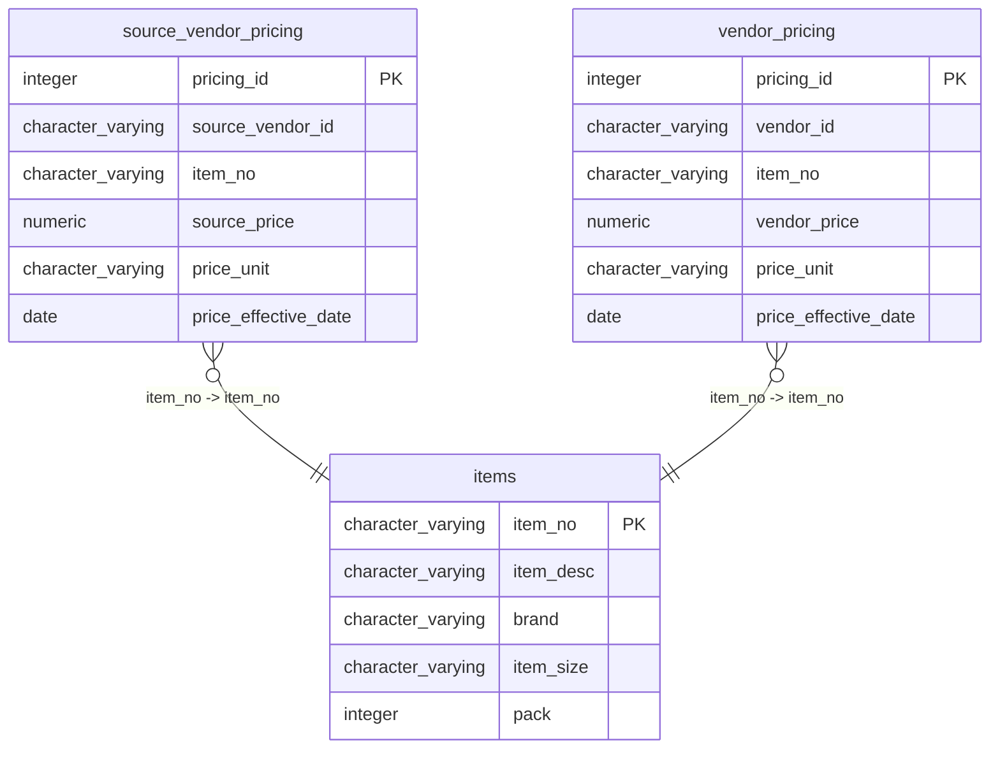

# items

## Overview
The `items` table serves as the master catalog for food service supply chain products, likely tracking grocery or restaurant inventory based on the sample data. It stores core attributes for each product, including a unique identification number, descriptive name, manufacturer, physical size, and pack quantity. The data indicates a focus on perishable and bulk-purchased goods such as produce, meat, and frozen chicken.

## Entity Relationship Diagram


## Column Reference Table
| Column | Type | Nullable | Default | Description |
|---|---|---|---|---|
| item_no | character varying(20) | No |  | Unique identifier for the inventory item or product. |
| item_desc | character varying(200) | Yes |  | Human-readable description of the product details. |
| brand | character varying(50) | Yes |  | Name of the supplier or manufacturer for the item. |
| item_size | character varying(30) | Yes |  | Unit size or quantity specification of the product. |
| pack | integer | Yes |  | Number of units per pack for inventory tracking. |

## Business Rules
One business rule is enforced at the database level:
- **`items_item_no_not_null`**: Ensures that the `item_no` column is always populated (`item_no IS NOT NULL`), acting as the mandatory identifier for every record.

The following conventions are observed in the sample data but are **not** enforced by the database:
- ***Inferred***: The `item_no` follows a specific naming pattern, beginning with "SUPC-" followed by a six-digit alphanumeric code (e.g., `SUPC-200002`).
- ***Inferred***: The `item_desc` is stored in all uppercase letters, often including the brand or product name, followed by a size indicator.
- ***Inferred***: The `item_size` column uses standardized abbreviations for units of measure (e.g., `24CT` for count, `10LB` for pounds, `4OZ` for ounces).
- ***Inferred***: The `pack` column contains an integer representing the number of units per pack, which may or may not strictly correlate to the numeric value in `item_size` (e.g., `item_size` "10LB" has a `pack` of 6).

## Common Query Examples
Find the description and brand for a specific item number.
```sql
SELECT item_desc, brand
FROM items
WHERE item_no = 'SUPC-200002';
```

List all items from a specific brand, ordered by item description.
```sql
SELECT item_no, item_desc, pack
FROM items
WHERE brand = 'Sysco'
ORDER BY item_desc;
```

Retrieve items that display a specific size unit, such as pounds.
```sql
SELECT item_no, item_desc, brand
FROM items
WHERE item_size LIKE '%LB';
```

Count the total number of packs available for each brand.
```sql
SELECT brand, SUM(pack) AS total_packs
FROM items
GROUP BY brand;
```

## Index Documentation
- **`items_pkey`**: Primary key index on the `item_no` column. This index is unique, ensuring no duplicate item numbers exist and facilitating fast lookups by primary key.

## Migration History
This database has no migration-tracking table (checked for alembic, flyway, django, knex, and sequelize conventions). Schema changes here are not currently tracked.

## Related
- [[relationships/source_vendor_pricing-items]]
- [[relationships/vendor_pricing-items]]
- [[relationships/overview]]
- [[domains/product-catalog]]
- [[erd]]
- [[overview]]
- [[index]]
