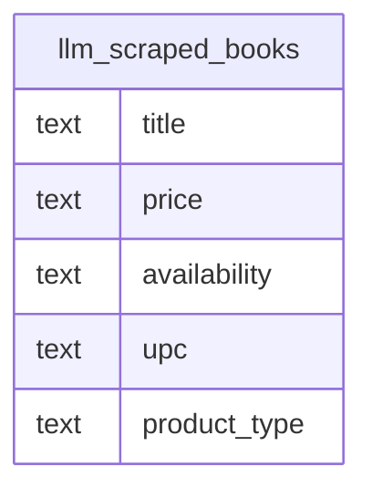

# llm_scraped_books

## Overview
The `llm_scraped_books` table appears to store bibliographic and commercial data for books, likely extracted from online retail sources via scraping or LLM-assisted parsing. It captures essential product details such as title, price, stock status, and a unique product identifier (UPC). Given the generic product type and lack of primary keys, this table likely serves as a raw or intermediate staging area for product catalog ingestion.

## Entity Relationship Diagram


This table has no foreign-key relationships to other tables in the schema.

## Column Reference Table
| Column | Type | Nullable | Default | Description |
|---|---|---|---|---|
| title | text | Yes |  | The full name or heading of the book product. |
| price | text | Yes |  | The current selling cost of the item, including currency symbol. |
| availability | text | Yes |  | Inventory status indicating stock presence and available quantity. |
| upc | text | Yes |  | Unique identifier code for the specific book product. |
| product_type | text | Yes |  |  |

## Business Rules
No business rules are enforced at the database level, as no check constraints are defined. The following conventions are observed in the sample data and are *inferred*, not enforced:
*   The `price` column stores monetary values as text strings including currency symbols (e.g., "£51.77").
*   The `availability` column contains descriptive text detailing stock levels rather than a simple binary flag or integer count.
*   The `upc` column stores alphanumeric identifiers, which may not strictly follow standard UPC-A or EAN-13 numeric formats.
*   The `product_type` column consistently categorizes items as "Books".

## Common Query Examples
Retrieve all books that are currently in stock:
```sql
SELECT title, price, availability
FROM llm_scraped_books
WHERE availability LIKE 'In stock%';
```

Find books with a specific UPC:
```sql
SELECT title, price, product_type
FROM llm_scraped_books
WHERE upc = 'a897fe39b1053632';
```

List all unique product types present in the scraped data:
```sql
SELECT DISTINCT product_type
FROM llm_scraped_books;
```

Search for books by partial title match:
```sql
SELECT title, price, upc
FROM llm_scraped_books
WHERE title ILIKE '%attic%';
```

## Index Documentation
No indexes are currently defined on this table. To improve performance for the query examples above, consider adding the following indexes:
*   An index on `upc` to speed up lookups by product ID.
*   A GIN index using `pg_trgm` on `title` to enable efficient full-text search and partial string matching.

## Migration History
This database has no migration-tracking table (checked for alembic, flyway, django, knex, and sequelize conventions). Schema changes here are not currently tracked.

## Related
This table has no foreign-key relationships to other tables in the schema.
- [[domains/web-data-user-access]]
- [[enums/product_type]]
- [[erd]]
- [[overview]]
- [[index]]
