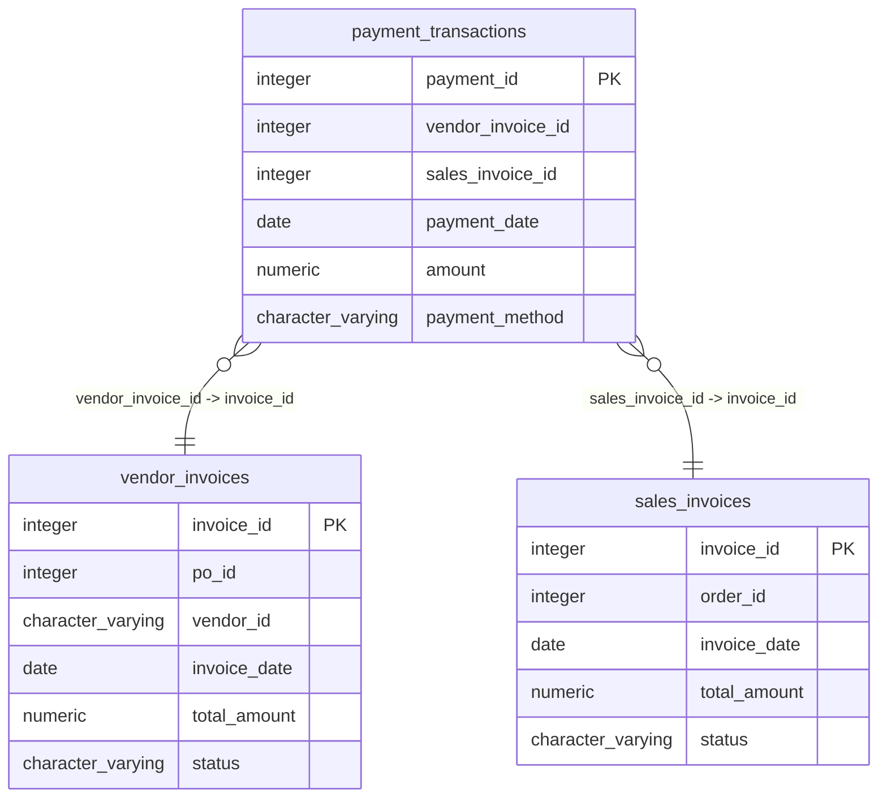

# payment_transactions

## Overview
The `payment_transactions` table tracks financial transactions associated with either vendor invoices or sales invoices. Each transaction includes details such as the payment date, amount, and method of payment. The structure of this table indicates its role in managing and validating payments within a financial system.

## Entity Relationship Diagram


## Column Reference Table
| Column | Type | Nullable | Default | Description |
|---|---|---|---|---|
| payment_id | integer | No | nextval('payment_transactions_payment_id_seq'::regclass) | Unique identifier for each payment transaction. |
| vendor_invoice_id | integer | Yes |  | Invoice ID from vendor, if applicable. |
| sales_invoice_id | integer | Yes |  | Invoice ID for the sale related to the payment. |
| payment_date | date | No |  | Date when the payment was made. |
| amount | numeric(12,2) | No |  | Total monetary value of the payment. |
| payment_method | character varying(30) | Yes |  | Method used for the payment (e.g., ACH). |

## Business Rules
The table enforces several business rules through check constraints:
- The **vendor_invoice_id** and **sales_invoice_id** fields cannot both be populated; one must be `NULL` while the other is filled. This ensures that a payment is clearly associated either with a vendor invoice or a sales invoice, but not both.
- The **payment_id** must not be `NULL`, ensuring every transaction has a unique identifier.
- The **payment_date** must not be `NULL`, meaning every transaction must have a recorded date.
- The **amount** must not be `NULL`, enforcing that every payment transaction has a specified monetary value.

## Common Query Examples
```sql
-- Retrieve all payment transactions made on a specific date
SELECT * FROM payment_transactions
WHERE payment_date = '2025-07-25';
```

```sql
-- Sum total payments made via ACH method
SELECT SUM(amount) AS total_ach_payments
FROM payment_transactions
WHERE payment_method = 'ACH';
```

```sql
-- Get all transactions related to a specific sales invoice
SELECT * FROM payment_transactions
WHERE sales_invoice_id = 1;
```

```sql
-- Count the number of transactions recorded for each payment method
SELECT payment_method, COUNT(*) AS transaction_count
FROM payment_transactions
GROUP BY payment_method;
```

## Index Documentation
The following index is defined on the `payment_transactions` table:
- **payment_transactions_pkey**: Unique index on the `payment_id` column (Primary Key)

Given the queries above, two additional indexes that would be beneficial are:
- An index on the `payment_date` column to optimize date-based queries.
- An index on the `payment_method` column to improve performance for queries filtering by payment methods.

## Migration History
This database has no migration-tracking table (checked for alembic, flyway, django, knex, and sequelize conventions). Schema changes here are not currently tracked.

## Related
- [[relationships/payment_transactions-vendor_invoices]]
- [[relationships/payment_transactions-sales_invoices]]
- [[relationships/overview]]
- [[domains/order-management]]
- [[queries/vendor-invoices-payment-transactions]] — Vendor invoices with payment transactions
- [[queries/sales-invoice-payment-details]] — Sales invoice details including payment transactions
- [[erd]]
- [[overview]]
- [[index]]
