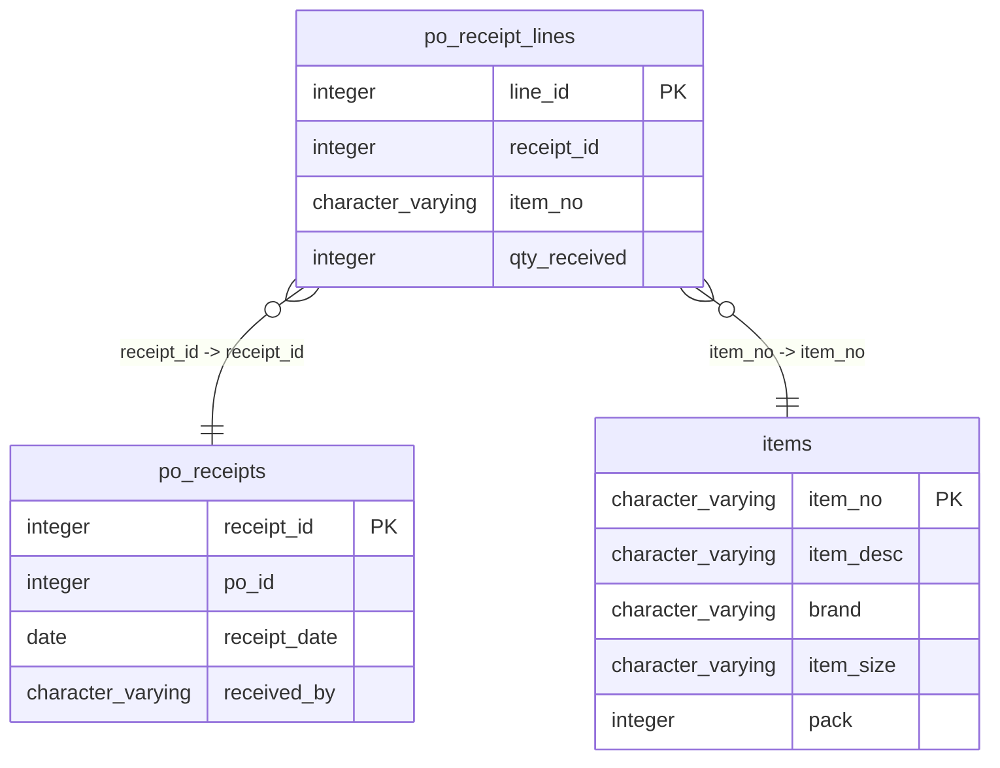

# po_receipt_lines

## Overview
The `po_receipt_lines` table is designed to store detailed information about receipt lines associated with purchase order receipts. Each row contains a unique line identifier, the receipt that the line is part of, the item number, and the quantity of the item that was received. This structure facilitates tracking the receipt of items, ensuring accurate inventory records.

## Entity Relationship Diagram


## Column Reference Table
| Column | Type | Nullable | Default | Description |
|---|---|---|---|---|
| line_id | integer | No | nextval('po_receipt_lines_line_id_seq'::regclass) | Unique identifier for each receipt line item. |
| receipt_id | integer | No |  | Identifier linking to the related receipt. |
| item_no | character varying(20) | No |  | Identification number for the received item. |
| qty_received | integer | No |  | Quantity of the item received in the transaction. |

## Business Rules
The table enforces several business rules through check constraints:
- `po_receipt_lines_line_id_not_null`: Ensures that each receipt line has a unique identifier (`line_id`) that cannot be null.
- `po_receipt_lines_receipt_id_not_null`: Requires that each receipt line must be associated with a valid receipt (`receipt_id`), which cannot be null.
- `po_receipt_lines_item_no_not_null`: Mandates that each receipt line must reference an item number (`item_no`), ensuring no empty records for items.
- `po_receipt_lines_qty_received_not_null`: Guarantees that the quantity received (`qty_received`) must be specified for every receipt line.

## Common Query Examples
```sql
-- Retrieve all receipt lines for a specific receipt
SELECT * FROM po_receipt_lines WHERE receipt_id = 1;
```
```sql
-- Count the total quantity received for a specific item
SELECT SUM(qty_received) FROM po_receipt_lines WHERE item_no = 'SUPC-200002';
```
```sql
-- Get the item numbers and quantities received for all lines
SELECT item_no, qty_received FROM po_receipt_lines;
```
```sql
-- Find the number of receipt lines that have received more than 50 units
SELECT COUNT(*) FROM po_receipt_lines WHERE qty_received > 50;
```

## Index Documentation
- **Index Name:** `po_receipt_lines_pkey`
  - **Columns:** `line_id`
  - **Uniqueness:** Unique (Primary Key)

As there are no additional indexes provided in the facts, it could be beneficial to consider adding indexes on the `receipt_id` and `item_no` columns to enhance the performance of queries that filter on these columns.

## Migration History
This database has no migration-tracking table (checked for alembic, flyway, django, knex, and sequelize conventions). Schema changes here are not currently tracked.

## Related
- [[relationships/po_receipt_lines-items]]
- [[relationships/po_receipt_lines-po_receipts]]
- [[relationships/overview]]
- [[domains/logistics]]
- [[erd]]
- [[overview]]
- [[index]]
