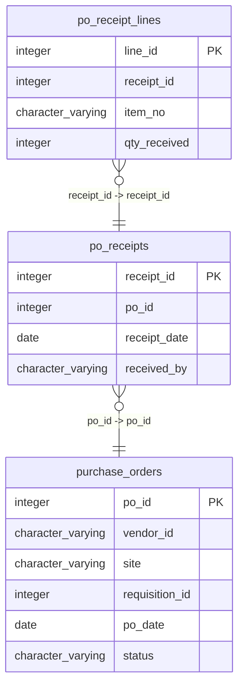

# po_receipts

## Overview
The `po_receipts` table is designed to track receipts associated with purchase orders within a business context. It includes key information such as the receipt identifier, the associated purchase order ID, the date the receipt was recorded, and the individual who received the items. This enables efficient auditing and tracking of inventory as it arrives.

## Entity Relationship Diagram


## Column Reference Table
| Column | Type | Nullable | Default | Description |
|---|---|---|---|---|
| receipt_id | integer | No | nextval('po_receipts_receipt_id_seq'::regclass) | Unique identifier for each receipt record. |
| po_id | integer | No |  | Identifier referencing associated purchase order. |
| receipt_date | date | No |  | Date when the receipt was recorded. |
| received_by | character varying(100) | Yes |  | Name of the person who received the items. |

## Business Rules
The following check constraints enforce specific rules at the database level:
- `po_receipts_receipt_id_not_null`: Ensures that `receipt_id` cannot be null, guaranteeing that every receipt has a unique identifier.
- `po_receipts_po_id_not_null`: Ensures that `po_id` cannot be null, indicating that every receipt must be linked to an existing purchase order.
- `po_receipts_receipt_date_not_null`: Ensures that `receipt_date` cannot be null, requiring that a receipt date is always recorded.

*Inferred*: 
- Receipts appear to be managed by department personnel, as indicated by the `received_by` column, which typically references staff roles.
- Each receipt corresponds to a specific purchase order, reflecting a one-to-one relationship in recorded transactions.
- Receipt dates seem to be chronologically ordered, likely to facilitate sorting and tracking of inventory arrivals.

## Common Query Examples
Retrieve all receipts along with their associated purchase order IDs:
```sql
SELECT receipt_id, po_id, receipt_date, received_by FROM po_receipts;
```

Select receipts received by a specific individual:
```sql
SELECT * FROM po_receipts WHERE received_by = 'Warehouse Lead';
```

Find receipts within a specific date range:
```sql
SELECT * FROM po_receipts WHERE receipt_date BETWEEN '2025-01-01' AND '2025-12-31';
```

Count the number of receipts linked to each purchase order:
```sql
SELECT po_id, COUNT(receipt_id) AS receipt_count FROM po_receipts GROUP BY po_id;
```

## Index Documentation
- `po_receipts_pkey`: This is the primary key index on the `receipt_id` column and is unique. 

There are no additional indexes listed for this table. Considering potential query needs, it may be beneficial to create:
- An index on the `po_id` column to optimize lookups by purchase order.
- An index on the `receipt_date` column to facilitate efficient range queries by receipt date.

## Migration History
This database has no migration-tracking table (checked for alembic, flyway, django, knex, and sequelize conventions). Schema changes here are not currently tracked.

## Related
- [[relationships/po_receipt_lines-po_receipts]]
- [[relationships/po_receipts-purchase_orders]]
- [[relationships/overview]]
- [[domains/logistics]]
- [[erd]]
- [[overview]]
- [[index]]
