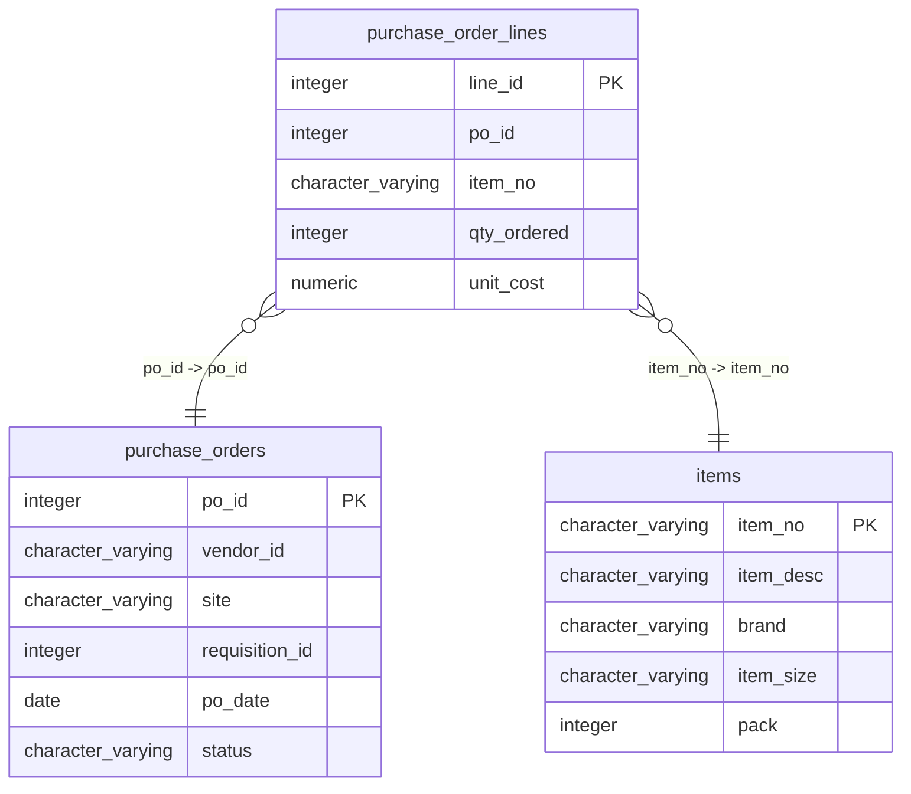

# purchase_order_lines

## Overview
The `purchase_order_lines` table tracks individual line items within purchase orders. Each row represents a specific item ordered, detailing its quantity and cost, as well as linking to the corresponding purchase order and item records. This structure supports efficient management of purchase orders and inventory.

## Entity Relationship Diagram


## Column Reference Table
| Column | Type | Nullable | Default | Description |
|---|---|---|---|---|
| line_id | integer | No | nextval('purchase_order_lines_line_id_seq'::regclass) | Unique identifier for each purchase order line item. |
| po_id | integer | No |  | Identifier for the related purchase order. |
| item_no | character varying(20) | No |  | Product SKU or item number being ordered. |
| qty_ordered | integer | No |  | Quantity of the item ordered in this line. |
| unit_cost | numeric(10,4) | No |  | Cost per unit of the item ordered. |

## Business Rules
The following check constraints are enforced at the database level:
- `purchase_order_lines_line_id_not_null`: Ensures that every line item has a non-null `line_id`, establishing it as a unique identifier.
- `purchase_order_lines_po_id_not_null`: Requires that the `po_id` is not null, ensuring that each line item is associated with a purchase order.
- `purchase_order_lines_item_no_not_null`: Ensures that `item_no` is not null, indicating that each line item must reference a valid item.
- `purchase_order_lines_qty_ordered_not_null`: Requires `qty_ordered` to be non-null, indicating that the quantity must be specified for each line.
- `purchase_order_lines_unit_cost_not_null`: Ensures that `unit_cost` is not null, requiring that each line item has an associated cost.

## Common Query Examples
Retrieve all purchase order lines for a specific purchase order:
```sql
SELECT *
FROM purchase_order_lines
WHERE po_id = 1;
```

Calculate the total cost for each item in a specific purchase order:
```sql
SELECT item_no, SUM(qty_ordered * unit_cost) AS total_cost
FROM purchase_order_lines
WHERE po_id = 1
GROUP BY item_no;
```

Find the average unit cost of items ordered:
```sql
SELECT AVG(unit_cost) AS average_unit_cost
FROM purchase_order_lines;
```

Get the total quantity ordered for each item:
```sql
SELECT item_no, SUM(qty_ordered) AS total_quantity
FROM purchase_order_lines
GROUP BY item_no;
```

## Index Documentation
- **Index Name:** `purchase_order_lines_pkey`
  - **Column:** `line_id`
  - **Unique:** Yes
  - **Primary:** Yes

Since only a primary key index is noted, consider creating additional indexes on the following:
- An index on `po_id` for faster lookups of purchase order lines by purchase order.
- An index on `item_no` to improve performance when querying items across multiple purchase orders.

## Migration History
This database has no migration-tracking table (checked for alembic, flyway, django, knex, and sequelize conventions). Schema changes here are not currently tracked.

## Related
- [[relationships/purchase_order_lines-items]]
- [[relationships/purchase_order_lines-purchase_orders]]
- [[relationships/overview]]
- [[domains/pricing]]
- [[queries/unshipped-items-purchase-orders]] — Unshipped items in pending purchase orders
- [[erd]]
- [[overview]]
- [[index]]
