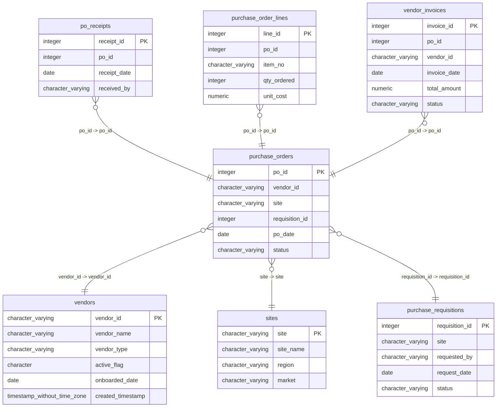

# purchase_orders

## Overview
The `purchase_orders` table is designed to track the purchase orders made by a business, including critical details like the vendor, site, requisition ID, date of the order, and its current status. This table serves to facilitate the management and organization of purchase orders, allowing users to monitor order dates and statuses for inventory and operational activities.

## Entity Relationship Diagram


## Column Reference Table
| Column | Type | Nullable | Default | Description |
|---|---|---|---|---|
| po_id | integer | No | nextval('purchase_orders_po_id_seq'::regclass) | Unique identifier for each purchase order. |
| vendor_id | character varying(20) | No |  | Identifier for the vendor supplying the purchase order. |
| site | character varying(10) | No |  | Code representing the location for the order. |
| requisition_id | integer | Yes |  | Identifier linking to the original requisition request. |
| po_date | date | No |  | Date when the purchase order was created. |
| status | character varying(20) | Yes | 'Open'::character varying | Current status of the purchase order (e.g., Open, Closed). |

## Business Rules
The following business rules are enforced at the database level via check constraints:
- `purchase_orders_po_id_not_null`: Ensures that each purchase order has a unique identifier (`po_id`) that cannot be null.
- `purchase_orders_vendor_id_not_null`: Requires that each purchase order is associated with a valid vendor ID (`vendor_id`), which cannot be null.
- `purchase_orders_site_not_null`: Ensures that each purchase order is linked to a valid site (`site`), which cannot be null.
- `purchase_orders_po_date_not_null`: Requires that each purchase order has a date (`po_date`), which cannot be null.

## Common Query Examples
Retrieve all closed purchase orders:
```sql
SELECT * FROM purchase_orders WHERE status = 'Closed';
```

Count the total number of purchase orders by status:
```sql
SELECT status, COUNT(*) FROM purchase_orders GROUP BY status;
```

Find purchase orders for a specific vendor:
```sql
SELECT * FROM purchase_orders WHERE vendor_id = 'V00234';
```

Get the details of purchase orders placed within a specific date range:
```sql
SELECT * FROM purchase_orders WHERE po_date BETWEEN '2025-01-01' AND '2025-01-31';
```

## Index Documentation
The following index is defined for the `purchase_orders` table:
- **Index Name**: `purchase_orders_pkey`
  - **Columns**: `po_id`
  - **Uniqueness**: Unique, Primary Key

If no indexes were present, one suggested index would be on the `vendor_id` column to speed up queries filtering by vendor, and another on the `po_date` column to optimize date-range queries.

## Migration History
This database has no migration-tracking table (checked for alembic, flyway, django, knex, and sequelize conventions). Schema changes here are not currently tracked.

## Related
- [[relationships/po_receipts-purchase_orders]]
- [[relationships/purchase_order_lines-purchase_orders]]
- [[relationships/purchase_orders-vendors]]
- [[relationships/purchase_orders-purchase_requisitions]]
- [[relationships/purchase_orders-sites]]
- [[relationships/vendor_invoices-purchase_orders]]
- [[relationships/overview]]
- [[domains/order-management]]
- [[enums/site]]
- [[enums/status]]
- [[queries/unshipped-items-purchase-orders]] — Unshipped items in pending purchase orders
- [[queries/customer-credit-terms-purchase-orders]] — Customer credit terms associated with purchase orders
- [[queries/purchase-orders-assoc-invoices]] — Purchase Orders Associated with Invoices
- [[erd]]
- [[overview]]
- [[index]]
