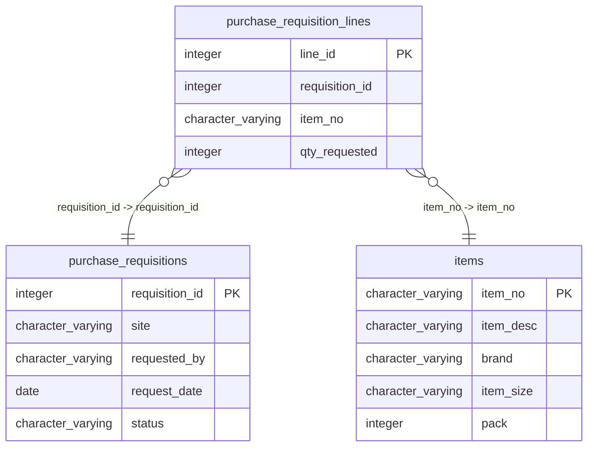

# purchase_requisition_lines

## Overview
The `purchase_requisition_lines` table appears to serve as a detailed record of items requested in purchase requisitions. Each row includes a unique line identifier, a reference to the associated requisition, item number, and the quantity requested, as indicated by the provided sample data.

## Entity Relationship Diagram


## Column Reference Table
| Column | Type | Nullable | Default | Description |
|---|---|---|---|---|
| line_id | integer | No | nextval('purchase_requisition_lines_line_id_seq'::regclass) | Unique identifier for each purchase requisition line. |
| requisition_id | integer | No |  | Identifier linking to the associated purchase requisition. |
| item_no | character varying(20) | No |  | Unique item number for the requested product. |
| qty_requested | integer | No |  | Quantity of the item requested in the requisition. |

## Business Rules
The table enforces several business rules through check constraints:
- `purchase_requisition_lines_line_id_not_null`: Ensures that every line has a valid line ID, which cannot be null.
- `purchase_requisition_lines_requisition_id_not_null`: Requires that every item line corresponds to a requisition ID that cannot be null.
- `purchase_requisition_lines_item_no_not_null`: Guarantees that each line references a valid item number, which cannot be null.
- `purchase_requisition_lines_qty_requested_not_null`: Ensures that the quantity requested for each line is provided and cannot be null.

## Common Query Examples
Retrieve all purchase requisition lines for a specific requisition:
```sql
SELECT * FROM purchase_requisition_lines WHERE requisition_id = 1;
```

Get the total quantity requested for a specific item number across all requisitions:
```sql
SELECT SUM(qty_requested) FROM purchase_requisition_lines WHERE item_no = 'SUPC-200002';
```

List all unique item numbers in purchase requisition lines:
```sql
SELECT DISTINCT item_no FROM purchase_requisition_lines;
```

Find the quantity requested for a specific line ID:
```sql
SELECT qty_requested FROM purchase_requisition_lines WHERE line_id = 2;
```

## Index Documentation
- `purchase_requisition_lines_pkey`: 
  - Columns: `line_id`
  - Uniqueness: Yes (Primary Key)

Given the columns and the query examples, additional indexes that could enhance query performance include:
- An index on `requisition_id` to speed up lookups by requisition.
- An index on `item_no` to facilitate quicker aggregations or searches by item number.

## Migration History
This database has no migration-tracking table (checked for alembic, flyway, django, knex, and sequelize conventions). Schema changes here are not currently tracked.

## Related
- [[relationships/purchase_requisition_lines-purchase_requisitions]]
- [[relationships/purchase_requisition_lines-items]]
- [[relationships/overview]]
- [[domains/uncategorized]]
- [[queries/purchase-requisition-lines-items]] — Purchase requisition lines and their items
- [[erd]]
- [[overview]]
- [[index]]
