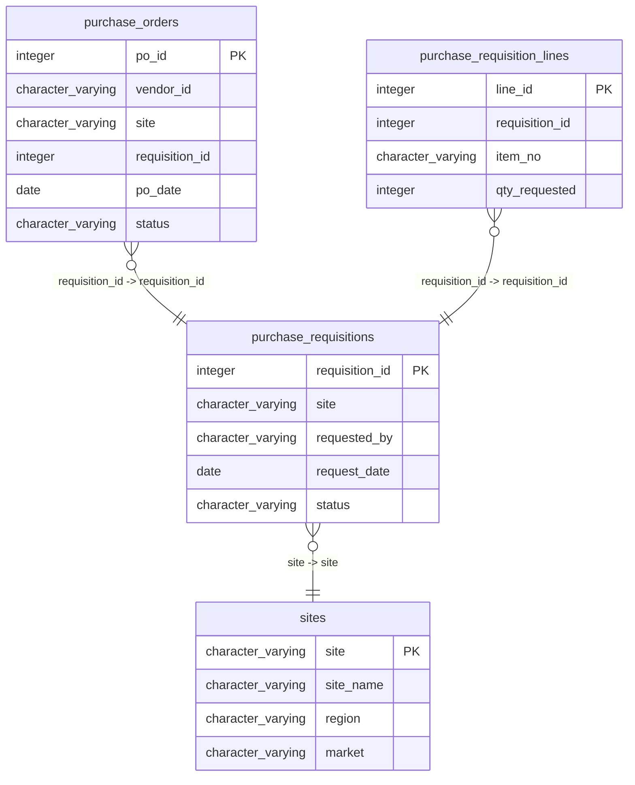

# purchase_requisitions

## Overview
The `purchase_requisitions` table tracks requests for purchasing items, detailing essential information such as the requisition ID, the site location, the individual making the request, the date of the request, and its current status. This table is likely used to manage and monitor procurement processes within an organization, ensuring that requests are documented and processed efficiently.

## Entity Relationship Diagram


## Column Reference Table
| Column | Type | Nullable | Default | Description |
|---|---|---|---|---|
| requisition_id | integer | No | nextval('purchase_requisitions_requisition_id_seq'::regclass) | Unique identifier for each purchase requisition. |
| site | character varying(10) | No |  | Code representing the location associated with the requisition. |
| requested_by | character varying(100) | Yes |  | Person or role initiating the requisition process. |
| request_date | date | No |  | Date when the requisition was submitted. |
| status | character varying(20) | Yes | 'Pending'::character varying | Current approval status of the purchase requisition. |

## Business Rules
The `purchase_requisitions` table enforces the following business rules through check constraints:
- `purchase_requisitions_requisition_id_not_null`: Ensures that every requisition has a unique identifier by prohibiting NULL values in the `requisition_id` column.
- `purchase_requisitions_site_not_null`: Guarantees that each requisition is associated with a valid site by preventing NULL values in the `site` column.
- `purchase_requisitions_request_date_not_null`: Requires that a request date is provided for every requisition to maintain accurate record-keeping.

*Inferred conventions from sample data:*
- Each requisition appears to be initiated by an individual in a managerial role, as indicated by the consistent `requested_by` value "Ops Manager."
- The `status` of the requests has consistently been "Approved" throughout the sample data, suggesting that these requisitions are processed positively.
- The `request_date` values are all future dates at the time of data entry, indicating that these requisitions are likely part of forward planning for procurement.

## Common Query Examples
```sql
-- Retrieve all approved purchase requisitions
SELECT * FROM purchase_requisitions WHERE status = 'Approved';
```
```sql
-- Count the number of requisitions requested by a specific individual (Ops Manager)
SELECT COUNT(*) FROM purchase_requisitions WHERE requested_by = 'Ops Manager';
```
```sql
-- Get requisition details for a specific site
SELECT * FROM purchase_requisitions WHERE site = '0091';
```
```sql
-- List all requisitions ordered by request date
SELECT * FROM purchase_requisitions ORDER BY request_date;
```

## Index Documentation
- **Index Name:** `purchase_requisitions_pkey`
  - **Column Name:** `requisition_id`
  - **Unique:** Yes
  - **Primary:** Yes

Given the common query examples, it might be beneficial to create the following indexes:
- An index on the `status` column to optimize queries filtering by requisition status.
- An index on the `site` column to improve the performance of site-specific inquiries.

## Migration History
This database has no migration-tracking table (checked for alembic, flyway, django, knex, and sequelize conventions). Schema changes here are not currently tracked.

## Related
- [[relationships/purchase_orders-purchase_requisitions]]
- [[relationships/purchase_requisition_lines-purchase_requisitions]]
- [[relationships/purchase_requisitions-sites]]
- [[relationships/overview]]
- [[domains/order-management]]
- [[enums/site]]
- [[enums/status]]
- [[erd]]
- [[overview]]
- [[index]]
