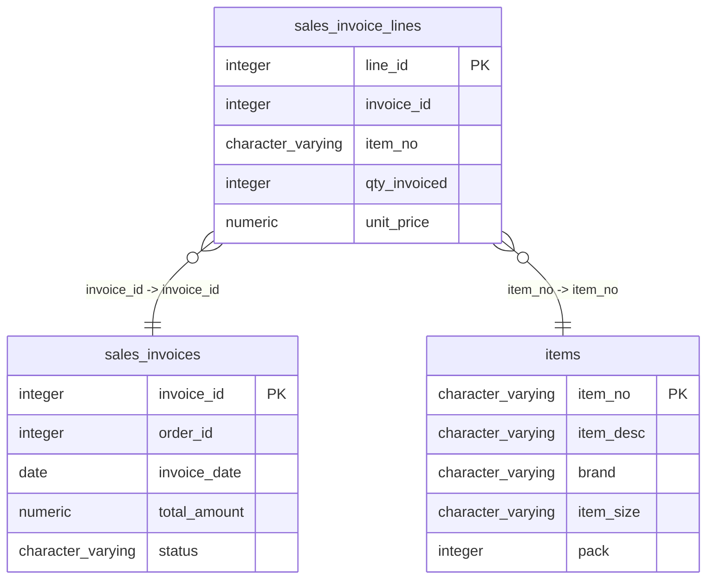

# sales_invoice_lines

## Overview
The `sales_invoice_lines` table is designed to store detailed line items associated with each sales invoice. It includes essential information such as the invoice ID, item number, quantity invoiced, and unit price, allowing for precise tracking of sales transactions. The table serves to facilitate invoice management by providing a structured representation of items sold under each invoice.

## Entity Relationship Diagram


## Column Reference Table
| Column | Type | Nullable | Default | Description |
|---|---|---|---|---|
| line_id | integer | No | nextval('sales_invoice_lines_line_id_seq'::regclass) | Unique identifier for each line item in the invoice. |
| invoice_id | integer | No |  | Identifier linking the line item to a specific invoice. |
| item_no | character varying(20) | No |  | Unique code identifying the item being sold. |
| qty_invoiced | integer | No |  | Quantity of the item that has been invoiced. |
| unit_price | numeric(10,4) | No |  | Price per unit of the item at the time of invoicing. |

## Business Rules
The table enforces the following business rules through check constraints:

- **line_id IS NOT NULL**: Ensures that each sales line has a valid identifier.
- **invoice_id IS NOT NULL**: Guarantees that each line item is linked to a specific invoice.
- **item_no IS NOT NULL**: Ensures that each line item references a valid item number.
- **qty_invoiced IS NOT NULL**: Guarantees that the quantity of items invoiced is specified.
- **unit_price IS NOT NULL**: Asserts that a unit price for each item is provided.

## Common Query Examples
Fetch all line items for a specific invoice by its ID:
```sql
SELECT * FROM sales_invoice_lines WHERE invoice_id = 1;
```

Calculate the total amount for a specific invoice based on quantity and unit price:
```sql
SELECT SUM(qty_invoiced * unit_price) AS total_amount FROM sales_invoice_lines WHERE invoice_id = 1;
```

Retrieve all items along with their quantities and prices for a specific item number:
```sql
SELECT item_no, qty_invoiced, unit_price FROM sales_invoice_lines WHERE item_no = 'SUPC-400004';
```

List all unique item numbers sold across all invoices:
```sql
SELECT DISTINCT item_no FROM sales_invoice_lines;
```

## Index Documentation
The following index is defined on the `sales_invoice_lines` table:

- **Index Name**: `sales_invoice_lines_pkey`
  - **Columns**: `line_id`
  - **Uniqueness**: Unique (Primary Key)

No additional indexes are specified in the provided information. Given the common queries, it might be beneficial to create indexes on `invoice_id` and `item_no` to optimize searches by these fields.

## Migration History
This database has no migration-tracking table (checked for alembic, flyway, django, knex, and sequelize conventions). Schema changes here are not currently tracked.

## Related
- [[relationships/sales_invoice_lines-sales_invoices]]
- [[relationships/sales_invoice_lines-items]]
- [[relationships/overview]]
- [[domains/pricing]]
- [[erd]]
- [[overview]]
- [[index]]
