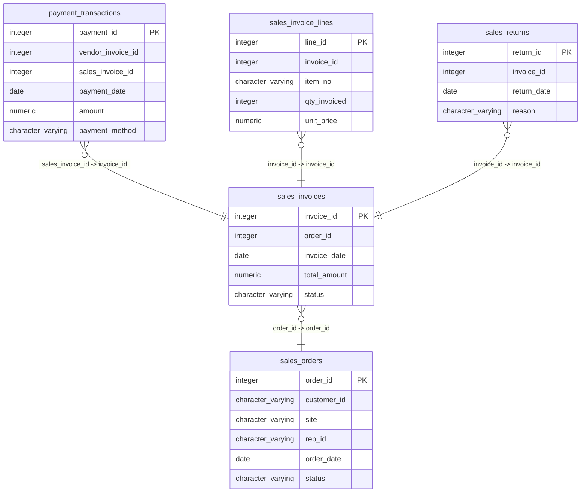

# sales_invoices

## Overview
The `sales_invoices` table tracks invoices associated with customer orders. It includes details such as unique invoice identifiers, related order IDs, invoice dates, total amounts billed, and the payment status. This structure facilitates the management of invoices and their corresponding sales data.

## Entity Relationship Diagram


## Column Reference Table
| Column | Type | Nullable | Default | Description |
|---|---|---|---|---|
| invoice_id | integer | No | nextval('sales_invoices_invoice_id_seq'::regclass) | Unique identifier for each invoice. |
| order_id | integer | No |  | Identifier for the related order. |
| invoice_date | date | No |  | Date when the invoice was issued. |
| total_amount | numeric(12,2) | Yes |  | Total monetary amount due on the invoice. |
| status | character varying(20) | Yes | 'Unpaid'::character varying | Current payment status of the invoice. |

## Business Rules
The following check constraints are enforced at the database level:
- `sales_invoices_invoice_id_not_null`: Ensures that the `invoice_id` field cannot be null, meaning every invoice must have a unique identifier.
- `sales_invoices_order_id_not_null`: Ensures the `order_id` cannot be null, confirming that each invoice is linked to an existing order.
- `sales_invoices_invoice_date_not_null`: Ensures that the `invoice_date` is provided, indicating when the invoice was issued.

*Inferred* conventions based on sample data:
- Invoice amounts are formatted consistently as numeric values with two decimal places.
- Status values appear to be categorizations of payment status, such as "Paid" or "Unpaid".

## Common Query Examples
Retrieve all invoices with their respective payment statuses:
```sql
SELECT invoice_id, total_amount, status FROM sales_invoices;
```

Find invoices issued after a specific date:
```sql
SELECT * FROM sales_invoices WHERE invoice_date > '2025-03-01';
```

Count invoices grouped by their status:
```sql
SELECT status, COUNT(*) AS invoice_count FROM sales_invoices GROUP BY status;
```

Get details for a specific invoice:
```sql
SELECT * FROM sales_invoices WHERE invoice_id = 1;
```

## Index Documentation
The following index is defined for the `sales_invoices` table:
- **Index Name:** `sales_invoices_pkey`
  - **Column Name:** `invoice_id`
  - **Uniqueness:** Unique (Primary Key)

There are no additional indexes. It may be beneficial to add indexes on the `order_id` and `invoice_date` columns to improve query performance for searches based on these columns.

## Migration History
This database has no migration-tracking table (checked for alembic, flyway, django, knex, and sequelize conventions). Schema changes here are not currently tracked.

## Related
- [[relationships/payment_transactions-sales_invoices]]
- [[relationships/sales_invoice_lines-sales_invoices]]
- [[relationships/sales_invoices-sales_orders]]
- [[relationships/sales_returns-sales_invoices]]
- [[relationships/overview]]
- [[domains/order-management]]
- [[enums/status]]
- [[queries/recent-sales-orders]] — Recent sales orders and their total amounts
- [[queries/sales-invoice-payment-details]] — Sales invoice details including payment transactions
- [[erd]]
- [[overview]]
- [[index]]
