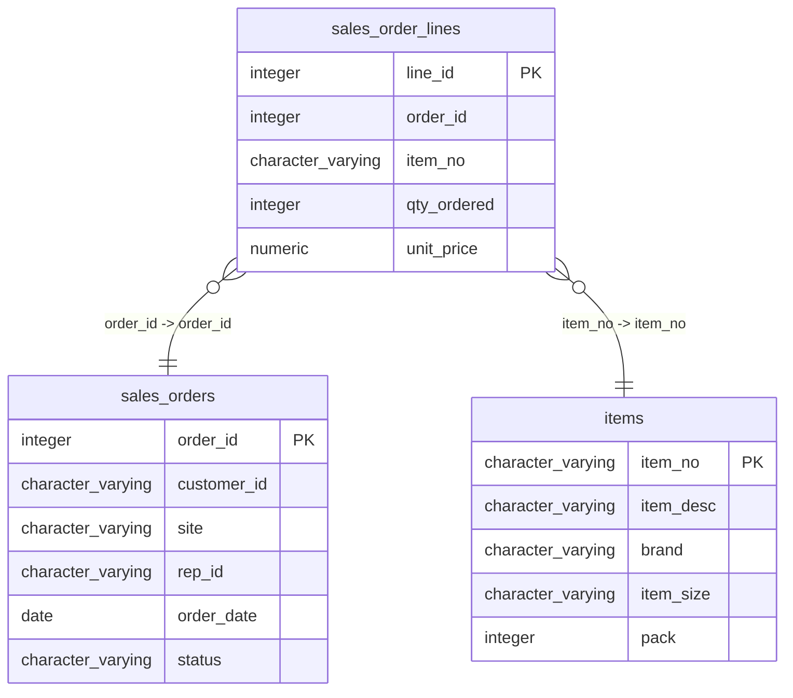

# sales_order_lines

## Overview
The `sales_order_lines` table is designed to capture the details of individual items within each sales order. It includes columns for identifying each line item, its associated order, the specific item description, the quantity ordered, and the unit price. The sample rows demonstrate how multiple items can be associated with a single order, highlighting the table's role in managing order line information for sales transactions.

## Entity Relationship Diagram


## Column Reference Table
| Column | Type | Nullable | Default | Description |
|---|---|---|---|---|
| line_id | integer | No | nextval('sales_order_lines_line_id_seq'::regclass) | Unique identifier for each order line item. |
| order_id | integer | No |  | References the associated sales order identifier. |
| item_no | character varying(20) | No |  | SKU or item number for the product ordered. |
| qty_ordered | integer | No |  | Quantity of the product ordered in the sale. |
| unit_price | numeric(10,4) | No |  | Price per unit of the product at the time of order. |

## Business Rules
The following check constraints are enforced at the database level:

- `sales_order_lines_line_id_not_null`: Ensures that the `line_id` is not null, which is crucial for the uniqueness of individual line items.
- `sales_order_lines_order_id_not_null`: Mandates that the `order_id` must be present, linking each line to a specific order.
- `sales_order_lines_item_no_not_null`: Requires that `item_no` cannot be null, ensuring every line item refers to a valid item.
- `sales_order_lines_qty_ordered_not_null`: Guarantees that the quantity ordered is specified, which is essential for sales calculations.
- `sales_order_lines_unit_price_not_null`: Ensures that the unit price is provided, which is necessary for computing the total cost of each line item.

## Common Query Examples
```sql
-- Retrieve all line items for a specific order with their details
SELECT * FROM sales_order_lines WHERE order_id = 1;
```

```sql
-- Calculate the total cost for a specific line item
SELECT line_id, qty_ordered * unit_price AS total_cost 
FROM sales_order_lines 
WHERE line_id = 2;
```

```sql
-- List all unique items ordered along with their total quantities
SELECT item_no, SUM(qty_ordered) AS total_qty_ordered 
FROM sales_order_lines 
GROUP BY item_no;
```

```sql
-- Get the average unit price for items in a specific order
SELECT AVG(unit_price) AS average_price 
FROM sales_order_lines 
WHERE order_id = 2;
```

## Index Documentation
The following index is defined on the `sales_order_lines` table:

- **Index Name**: `sales_order_lines_pkey`
  - **Column Name**: `line_id`
  - **Unique**: Yes
  - **Primary**: Yes

Since there are no additional indexes provided, it may be useful to consider adding the following indexes based on potential query patterns:

1. An index on `order_id` to speed up lookups for all line items associated with a specific order.
2. An index on `item_no` to facilitate quick access to line items by item number for inventory management or reporting purposes.

## Migration History
This database has no migration-tracking table (checked for alembic, flyway, django, knex, and sequelize conventions). Schema changes here are not currently tracked.

## Related
- [[relationships/sales_order_lines-sales_orders]]
- [[relationships/sales_order_lines-items]]
- [[relationships/overview]]
- [[domains/uncategorized]]
- [[erd]]
- [[overview]]
- [[index]]
