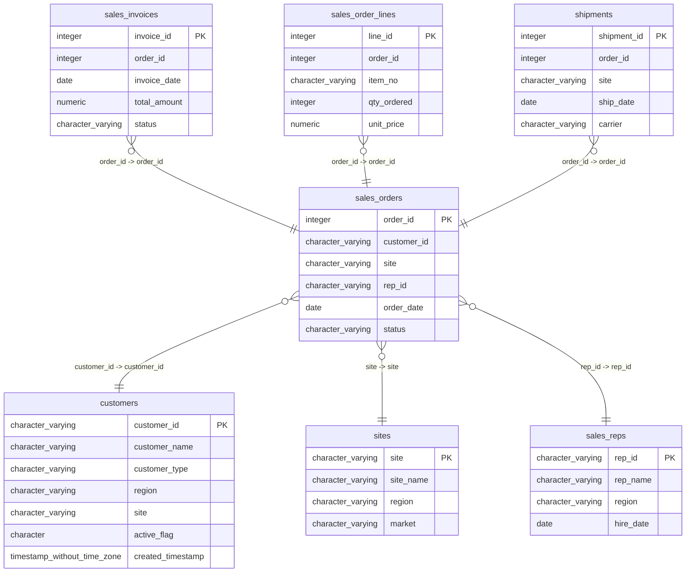

# sales_orders

## Overview
The `sales_orders` table is designed to track individual sales orders made by customers. It contains essential information such as the unique order ID, customer identification, the site where the order originated, the representative associated with the order, the order date, and its current status. This structure enables businesses to efficiently manage and analyze their sales transactions.

## Entity Relationship Diagram


## Column Reference Table
| Column | Type | Nullable | Default | Description |
|---|---|---|---|---|
| order_id | integer | No | nextval('sales_orders_order_id_seq'::regclass) | Unique identifier for each sales order. |
| customer_id | character varying(20) | No |  | Identifier for the customer placing the order. |
| site | character varying(10) | No |  | Location code where the order is processed. |
| rep_id | character varying(20) | Yes |  | Identifier for the sales representative handling the order. |
| order_date | date | No |  | Date when the order was placed. |
| status | character varying(20) | Yes | 'Open'::character varying | Current state of the order, e.g., Open or Closed. |

## Business Rules
The `sales_orders` table enforces several business rules through check constraints:
- `sales_orders_order_id_not_null`: Ensures that every order has a non-null `order_id`.
- `sales_orders_customer_id_not_null`: Ensures that every order is associated with a valid `customer_id`.
- `sales_orders_site_not_null`: Ensures that each order references a valid `site`.
- `sales_orders_order_date_not_null`: Ensures that the order date is provided for each order.

## Common Query Examples
Retrieve all orders along with their status:
```sql
SELECT * FROM sales_orders;
```

Find all open orders placed by a specific customer:
```sql
SELECT * FROM sales_orders WHERE customer_id = 'C00101' AND status = 'Open';
```

Count the total number of orders for each site:
```sql
SELECT site, COUNT(*) as total_orders FROM sales_orders GROUP BY site;
```

Get the orders placed by a specific sales representative within a date range:
```sql
SELECT * FROM sales_orders WHERE rep_id = 'R002' AND order_date BETWEEN '2025-01-01' AND '2025-03-31';
```

## Index Documentation
The `sales_orders` table has the following index:
- **Index Name**: `sales_orders_pkey`
  - **Column Name**: `order_id`
  - **Unique**: Yes
  - **Primary**: Yes

There are no additional indexes specified. However, indexes on the `customer_id`, `site`, and `rep_id` columns could enhance query performance, especially for filtering and joining operations in common queries analyzed earlier.

## Migration History
This database has no migration-tracking table (checked for alembic, flyway, django, knex, and sequelize conventions). Schema changes here are not currently tracked.

## Related
- [[relationships/sales_invoices-sales_orders]]
- [[relationships/sales_order_lines-sales_orders]]
- [[relationships/sales_orders-sales_reps]]
- [[relationships/sales_orders-sites]]
- [[relationships/sales_orders-customers]]
- [[relationships/shipments-sales_orders]]
- [[relationships/overview]]
- [[domains/order-management]]
- [[enums/site]]
- [[enums/status]]
- [[queries/recent-sales-orders]] — Recent sales orders and their total amounts
- [[queries/sales-reps-orders]] — Sales representatives and their associated sales orders
- [[queries/sales-orders-shipments]] — Sales orders with shipment details
- [[queries/customer-credit-terms-sales-orders]] — Customer credit terms to sales orders
- [[queries/customer-sales-orders]] — Customer Sales Order Details
- [[erd]]
- [[overview]]
- [[index]]
