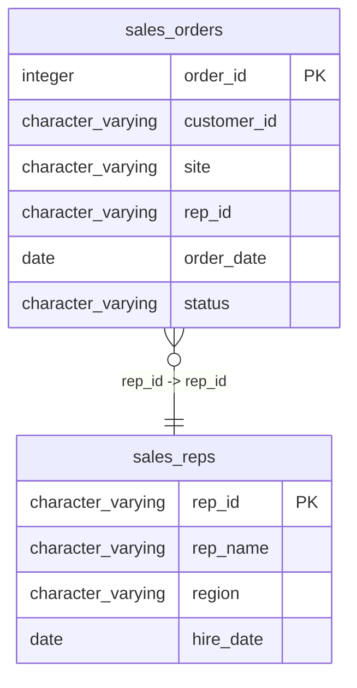

# sales_reps

## Overview
The `sales_reps` table maintains information about sales representatives within an organization. It includes details such as the representative's ID, name, the region they serve, and their hire date. This data is vital for tracking performance and managing sales operations effectively.

## Entity Relationship Diagram


## Column Reference Table
| Column | Type | Nullable | Default | Description |
|---|---|---|---|---|
| rep_id | character varying(20) | No |  | Unique identifier for each sales representative. |
| rep_name | character varying(100) | No |  | Full name of the sales representative. |
| region | character varying(50) | Yes |  | Geographical area assigned to the sales representative. |
| hire_date | date | Yes |  | Date when the sales representative was employed. |

## Business Rules
The table enforces two check constraints:
1. `sales_reps_rep_id_not_null`: Ensures that the `rep_id` cannot be null, meaning every sales representative must have a unique identifier.
2. `sales_reps_rep_name_not_null`: Ensures that the `rep_name` cannot be null, requiring every representative to have a name recorded.

*Inferred conventions from the sample data:*
- `rep_id` appears to follow a specific format, starting with the letter 'R' followed by a three-digit number.
- `region` designations seem to reflect geographical areas within the United States.
- `hire_date` is consistently formatted in the `YYYY-MM-DD` style, indicating a standardized date entry format.

## Common Query Examples
```sql
-- Retrieve all sales representatives in the Southeast region.
SELECT * FROM sales_reps WHERE region = 'Southeast';
```

```sql
-- Count the total number of sales representatives hired after January 1, 2020.
SELECT COUNT(*) FROM sales_reps WHERE hire_date > '2020-01-01';
```

```sql
-- Get the name and region of the sales representative with ID 'R002'.
SELECT rep_name, region FROM sales_reps WHERE rep_id = 'R002';
```

```sql
-- List all sales representatives ordered by their hire date.
SELECT * FROM sales_reps ORDER BY hire_date;
```

## Index Documentation
The `sales_reps` table has the following index:
- `sales_reps_pkey`: A unique index on the `rep_id` column, which serves as the primary key.

There are no additional indexes documented. However, it may be beneficial to consider creating indexes on the `region` and `hire_date` columns to enhance query performance, especially for filtering and sorting operations frequently performed based on these fields.

## Migration History
This database has no migration-tracking table (checked for alembic, flyway, django, knex, and sequelize conventions). Schema changes here are not currently tracked.

## Related
- [[relationships/sales_orders-sales_reps]]
- [[relationships/overview]]
- [[domains/uncategorized]]
- [[queries/sales-reps-orders]] — Sales representatives and their associated sales orders
- [[erd]]
- [[overview]]
- [[index]]
