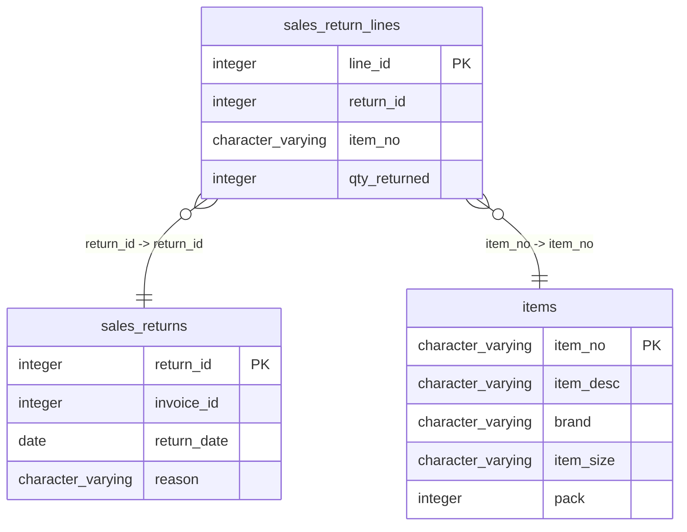

# sales_return_lines

## Overview
The `sales_return_lines` table captures the details of items returned in sales transactions. Each row corresponds to a specific line item in a return order, detailing the return ID, the item number, and the quantity returned. This structure enables tracking of returned products and their associated transactions.

## Entity Relationship Diagram


## Column Reference Table
| Column | Type | Nullable | Default | Description |
|---|---|---|---|---|
| line_id | integer | No | nextval('sales_return_lines_line_id_seq'::regclass) | Unique identifier for each sales return line item. |
| return_id | integer | No |  | Identifier for the associated sales return transaction. |
| item_no | character varying(20) | No |  | Product identifier for the returned item. |
| qty_returned | integer | No |  | Number of items returned in the transaction. |

## Business Rules
The following check constraints enforce business rules at the database level:
- `sales_return_lines_line_id_not_null`: Ensures that `line_id` cannot be null, establishing each return line's uniqueness.
- `sales_return_lines_return_id_not_null`: Ensures that `return_id` cannot be null, tying each line to a valid return.
- `sales_return_lines_item_no_not_null`: Ensures that `item_no` cannot be null, guaranteeing that every return line references an item.
- `sales_return_lines_qty_returned_not_null`: Ensures that `qty_returned` cannot be null, ensuring that the quantity returned is always specified.

## Common Query Examples
Retrieve all return lines for a specific return ID:
```sql
SELECT * FROM sales_return_lines WHERE return_id = 2;
```

Count the total quantity of items returned for a specific item number:
```sql
SELECT SUM(qty_returned) FROM sales_return_lines WHERE item_no = 'SUPC-200002';
```

List all unique items that have been returned:
```sql
SELECT DISTINCT item_no FROM sales_return_lines;
```

Find the return line with the highest quantity returned:
```sql
SELECT * FROM sales_return_lines ORDER BY qty_returned DESC LIMIT 1;
```

## Index Documentation
The following index exists for the `sales_return_lines` table:
- **Index Name**: `sales_return_lines_pkey`
  - **Column Name**: `line_id`
  - **Unique**: Yes
  - **Type**: Primary 

No additional indexes are currently defined. Given the queries above, it would be beneficial to create indexes on `return_id` and `item_no` to improve performance on those specific queries.

## Migration History
This database has no migration-tracking table (checked for alembic, flyway, django, knex, and sequelize conventions). Schema changes here are not currently tracked.

## Related
- [[relationships/sales_return_lines-items]]
- [[relationships/sales_return_lines-sales_returns]]
- [[relationships/overview]]
- [[domains/uncategorized]]
- [[erd]]
- [[overview]]
- [[index]]
