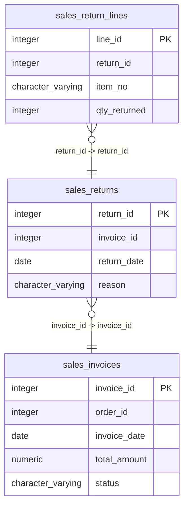

# sales_returns

## Overview
The `sales_returns` table tracks the details of product returns associated with sales invoices. Each return entry is characterized by the return identifier, the associated invoice identifier, the date of return, and the reason for the return. This table helps manage and analyze return transactions to improve customer service and inventory management.

## Entity Relationship Diagram


## Column Reference Table
| Column | Type | Nullable | Default | Description |
|---|---|---|---|---|
| return_id | integer | No | nextval('sales_returns_return_id_seq'::regclass) | Unique identifier for each sales return transaction. |
| invoice_id | integer | No |  | Identifier for the associated invoice of the return. |
| return_date | date | No |  | Date when the return was processed. |
| reason | character varying(100) | Yes |  | Explanation for the product return. |

## Business Rules
The following check constraints enforce essential integrity rules within the table:
- **Return ID Not Null**: The `return_id` must contain a value, ensuring that every return record is identifiable.
- **Invoice ID Not Null**: The `invoice_id` must contain a value, linking the return to a specific sales transaction.
- **Return Date Not Null**: The `return_date` must contain a value, establishing when the return occurred.

## Common Query Examples
```sql
-- Retrieve all return records along with their reasons
SELECT * FROM sales_returns;
```

```sql
-- Find return records for a specific invoice
SELECT * FROM sales_returns WHERE invoice_id = 1;
```

```sql
-- Count the number of returns made for each return reason
SELECT reason, COUNT(*) as return_count FROM sales_returns GROUP BY reason;
```

```sql
-- Get the most recent return date for a specific invoice
SELECT return_date FROM sales_returns WHERE invoice_id = 2 ORDER BY return_date DESC LIMIT 1;
```

## Index Documentation
The following index is defined on the `sales_returns` table:
- **sales_returns_pkey**: Unique index on `return_id`, ensuring each return record is uniquely identifiable.

Given the columns and queries, additional useful indexes might include:
- An index on `invoice_id` to improve query performance when filtering returns by invoice.
- An index on `return_date` to facilitate queries that sort or filter returns by date.

## Migration History
This database has no migration-tracking table (checked for alembic, flyway, django, knex, and sequelize conventions). Schema changes here are not currently tracked.

## Related
- [[relationships/sales_return_lines-sales_returns]]
- [[relationships/sales_returns-sales_invoices]]
- [[relationships/overview]]
- [[domains/order-management]]
- [[erd]]
- [[overview]]
- [[index]]
