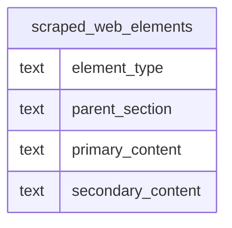

# scraped_web_elements

## Overview
This table serves as a structured repository for content extracted from web-based book catalogs, specifically capturing hierarchical page elements. It distinguishes between textual data and image assets, associating each piece of content with its respective page section. The primary goal is to store both the main data points and their secondary annotations for downstream processing or display.

## Entity Relationship Diagram


This table has no foreign-key relationships to other tables in the schema.

## Column Reference Table
| Column | Type | Nullable | Default | Description |
|---|---|---|---|---|
| element_type | text | Yes |  | The category of the scraped element, such as text or image_url. |
| parent_section | text | Yes |  | The logical section or area of the page from which the element originates. |
| primary_content | text | Yes |  | The main extracted data, such as a title, description, or direct image URL. |
| secondary_content | text | Yes |  | Supplementary information associated with the element, like an image caption or 'N/A'. |

## Business Rules
No business rules are enforced at the database level, as there are no check constraints defined. The following conventions are *inferred* from the sample data:

*   The `element_type` column appears to utilize a controlled vocabulary, specifically `text` and `image_url`, to categorize the data payload.
*   For rows where `element_type` is `text`, the `secondary_content` column frequently defaults to the string `"N/A"` rather than being null.
*   For rows where `element_type` is `image_url`, `primary_content` stores the URL, while `secondary_content` stores the associated label or title (e.g., the book title).
*   `parent_section` uses human-readable labels (e.g., "Book Title", "Product Cover") to denote the logical location of the element on the source page.

## Common Query Examples
Retrieve the title and cover image URL for the book "A Light in the Attic".
```sql
SELECT 
    title.primary_content AS book_title,
    cover.primary_content AS cover_url
FROM scraped_web_elements title
JOIN scraped_web_elements cover 
    ON title.primary_content = cover.secondary_content 
    AND cover.parent_section = "Product Cover"
WHERE 
    title.parent_section = "Book Title" 
    AND title.primary_content = "A Light in the Attic";
```

List all book descriptions that exceed a specific length to identify potential truncation or full-text records.
```sql
SELECT 
    primary_content,
    LENGTH(primary_content) AS content_length
FROM scraped_web_elements
WHERE parent_section = "Book Description"
  AND element_type = 'text'
  AND LENGTH(primary_content) > 200;
```

Find all image URLs associated with the "Product Cover" section.
```sql
SELECT primary_content
FROM scraped_web_elements
WHERE parent_section = "Product Cover"
  AND element_type = 'image_url';
```

Aggregate the count of scraped elements by their section to analyze data distribution.
```sql
SELECT 
    parent_section,
    element_type,
    COUNT(*) AS element_count
FROM scraped_web_elements
GROUP BY parent_section, element_type
ORDER BY element_count DESC;
```

## Index Documentation
The table currently has no indexes defined. Given the query patterns above, the following indexes would improve performance:

*   An index on `parent_section` and `element_type` would speed up filtering for specific data layouts, which is the most common operation in the sample queries.
*   An index on `primary_content` would be beneficial if the table is frequently joined to other tables or used to look up specific titles or URLs, though its effectiveness depends on the uniqueness of the content.

## Migration History
This database has no migration-tracking table (checked for alembic, flyway, django, knex, and sequelize conventions). Schema changes here are not currently tracked.

## Related
This table has no foreign-key relationships to other tables in the schema.
- [[domains/web-data-user-access]]
- [[enums/element_type]]
- [[erd]]
- [[overview]]
- [[index]]
