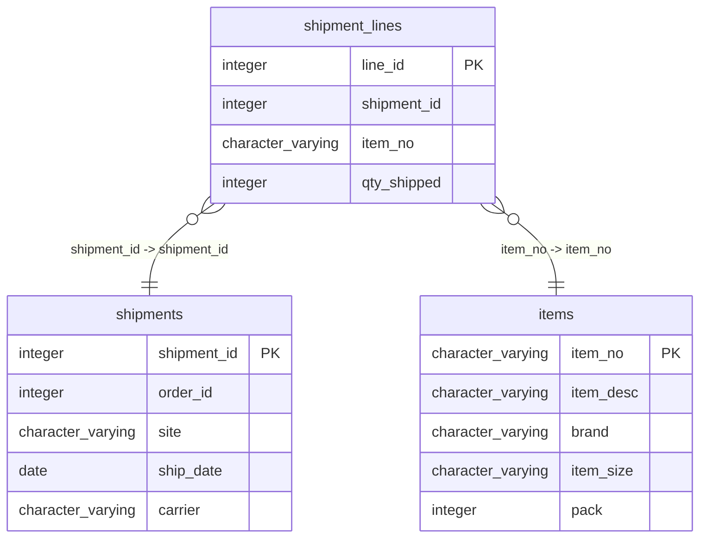

# shipment_lines

## Overview
The `shipment_lines` table tracks individual items within shipments, providing a detailed breakdown of what has been shipped. Each row represents a specific line in a shipment, including identifiers for the shipment and item, as well as the quantity shipped. This structure allows for precise inventory management and shipping records in a business context.

## Entity Relationship Diagram


## Column Reference Table
| Column | Type | Nullable | Default | Description |
|---|---|---|---|---|
| line_id | integer | No | nextval('shipment_lines_line_id_seq'::regclass) | Unique identifier for each shipment line entry. |
| shipment_id | integer | No |  | Identifier for the associated shipment. |
| item_no | character varying(20) | No |  | Number representing the specific item being shipped. |
| qty_shipped | integer | No |  | Quantity of the item included in the shipment. |

## Business Rules
The following check constraints enforce fundamental business rules at the database level:
- `shipment_lines_line_id_not_null`: Ensures that the `line_id` is always provided, making it a required field for identification.
- `shipment_lines_shipment_id_not_null`: Ensures that the `shipment_id` is always present, linking each line to a specific shipment.
- `shipment_lines_item_no_not_null`: Ensures that the `item_no` must be specified, preventing the creation of shipment lines without a corresponding item.
- `shipment_lines_qty_shipped_not_null`: Ensures that the `qty_shipped` field is not null, confirming that a quantity is required when recording a shipment line.

*Inferred* conventions from the sample data:
1. Each shipment can have multiple lines, as indicated by different `line_id` values for each `shipment_id`.
2. The `item_no` is formatted as a string with a standard prefix of "SUPC-".

## Common Query Examples
Retrieve all shipment lines for a specific shipment:
```sql
SELECT * FROM shipment_lines WHERE shipment_id = 1;
```

Count the total quantity shipped for a specific item:
```sql
SELECT SUM(qty_shipped) AS total_qty FROM shipment_lines WHERE item_no = 'SUPC-200002';
```

Find unique items shipped in all shipments:
```sql
SELECT DISTINCT item_no FROM shipment_lines;
```

List all shipment lines with their corresponding shipment IDs and quantities:
```sql
SELECT shipment_id, item_no, qty_shipped FROM shipment_lines ORDER BY shipment_id;
```

## Index Documentation
- **Index Name:** `shipment_lines_pkey`
  - **Column Name:** `line_id`
  - **Uniqueness:** Unique, Primary
  
No additional indexes are defined on this table. Given the common queries, it may also be beneficial to create the following indexes:
1. An index on `shipment_id` to speed up queries filtering by shipment.
2. An index on `item_no` to optimize queries searching for specific items across shipments.

## Migration History
This database has no migration-tracking table (checked for alembic, flyway, django, knex, and sequelize conventions). Schema changes here are not currently tracked.

## Related
- [[relationships/shipment_lines-shipments]]
- [[relationships/shipment_lines-items]]
- [[relationships/overview]]
- [[domains/logistics]]
- [[erd]]
- [[overview]]
- [[index]]
