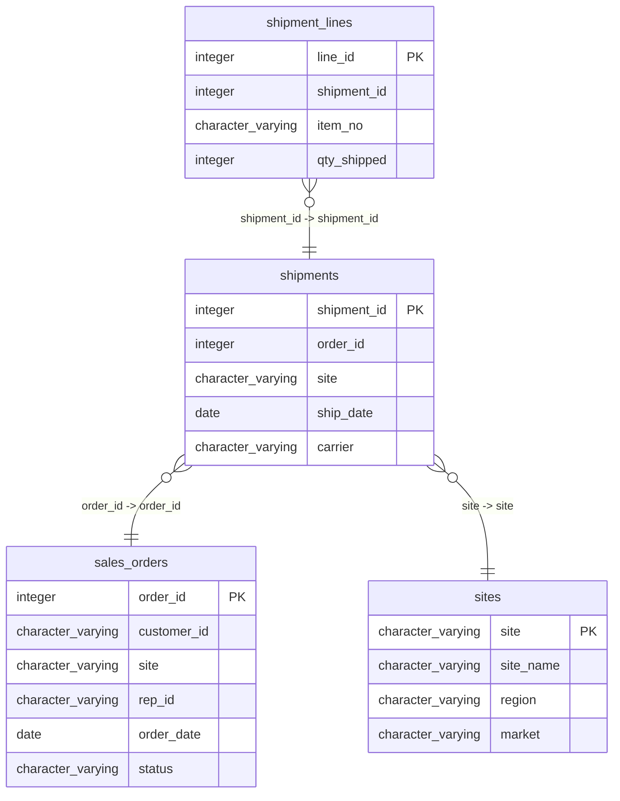

# shipments

## Overview
The "shipments" table tracks the shipment details associated with sales orders. It includes information such as the shipment ID, order ID, the site from which the shipment originates, the date it was shipped, and the carrier responsible for delivery. This table is essential for managing logistical operations and maintaining accurate records of shipments.

## Entity Relationship Diagram


## Column Reference Table
| Column | Type | Nullable | Default | Description |
|---|---|---|---|---|
| shipment_id | integer | No | nextval('shipments_shipment_id_seq'::regclass) | Unique identifier for each shipment record. |
| order_id | integer | No |  | Identifier for the associated order of the shipment. |
| site | character varying(10) | No |  | Code representing the shipment's destination site. |
| ship_date | date | Yes |  | Date when the shipment is scheduled to be sent. |
| carrier | character varying(50) | Yes |  | Name of the logistics company handling the shipment. |

## Business Rules
The following check constraints are enforced at the database level:
- **shipments_shipment_id_not_null**: Ensures that every shipment record has a non-null shipment ID.
- **shipments_order_id_not_null**: Ensures that every shipment record contains a non-null order ID, linking it appropriately to a sales order.
- **shipments_site_not_null**: Ensures that every shipment has a valid site code associated with it.

*Inferred conventions observed in the sample data:*
- All shipment IDs appear to be sequential integers, suggesting a continuous insertion pattern.
- The site codes are consistent in format, likely representing branch identifiers in a predefined manner.
- The carrier field shows a single consistent carrier ("FleetLogix") for all sample records, indicating a preferred vendor for shipping.

## Common Query Examples
Retrieve all shipments for a specific order:
```sql
SELECT * FROM shipments WHERE order_id = 1;
```

Count the total number of shipments by site:
```sql
SELECT site, COUNT(*) AS total_shipments FROM shipments GROUP BY site;
```

List shipments that were shipped after a specific date:
```sql
SELECT * FROM shipments WHERE ship_date > '2025-02-28';
```

Find the shipment details for a specific shipment ID:
```sql
SELECT * FROM shipments WHERE shipment_id = 2;
```

## Index Documentation
- **Index Name:** shipments_pkey
  - **Column Name:** shipment_id
  - **Unique:** Yes
  - **Primary:** Yes

No additional indexes are present. Given the columns and potential queries, it might be beneficial to create indexes on:
- `order_id` for faster lookups when querying by order.
- `site` for efficient grouping and counting of shipments by site.

## Migration History
This database has no migration-tracking table (checked for alembic, flyway, django, knex, and sequelize conventions). Schema changes here are not currently tracked.

## Related
- [[relationships/shipment_lines-shipments]]
- [[relationships/shipments-sites]]
- [[relationships/shipments-sales_orders]]
- [[relationships/overview]]
- [[domains/logistics]]
- [[enums/site]]
- [[queries/sales-orders-shipments]] — Sales orders with shipment details
- [[erd]]
- [[overview]]
- [[index]]
