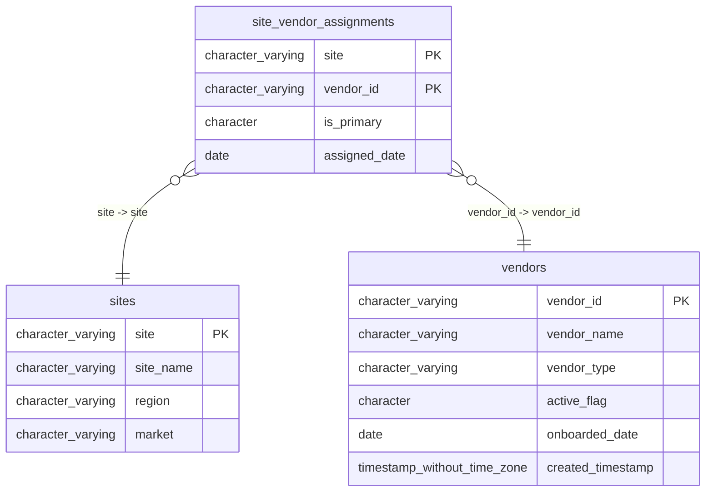

# site_vendor_assignments

## Overview
The `site_vendor_assignments` table manages the relationship between physical sites and their associated vendors. It records which specific vendor is assigned to a given site, including whether that vendor is designated as the primary partner. The data indicates that assignments are tracked with a specific start date, allowing for historical audits of vendor relationships.

## Entity Relationship Diagram


## Column Reference Table
| Column | Type | Nullable | Default | Description |
|---|---|---|---|---|
| site | character varying(10) | No |  | Unique code identifying the specific business location or branch. |
| vendor_id | character varying(20) | No |  | Unique identifier for the service provider assigned to the site. |
| is_primary | character(1) | Yes | 'Y'::bpchar | Flag indicating if this vendor is the main assigned partner. |
| assigned_date | date | Yes |  | Date when the vendor was assigned to the site. |

## Business Rules
The database enforces the following check constraints to ensure data integrity:
- **`site_vendor_assignments_site_not_null`**: The `site` column must not be null, ensuring every assignment is linked to a known site.
- **`site_vendor_assignments_vendor_id_not_null`**: The `vendor_id` column must not be null, ensuring every assignment is linked to a known vendor.

Inferred conventions based on sample data:
*   *Inferred*: The `is_primary` column uses a single-character code ('Y') to denote boolean-like status, likely implying 'N' is valid for non-primary assignments.
*   *Inferred*: `vendor_id` values follow a pattern starting with 'V' followed by numeric digits (e.g., 'V00234').
*   *Inferred*: `site` identifiers are numeric strings (e.g., '0091').

## Common Query Examples
Find the primary vendor assigned to a specific site.
```sql
SELECT vendor_id
FROM site_vendor_assignments
WHERE site = '0091' AND is_primary = 'Y';
```

List all vendors assigned to a specific site, ordered by assignment date.
```sql
SELECT vendor_id, is_primary, assigned_date
FROM site_vendor_assignments
WHERE site = '0055'
ORDER BY assigned_date DESC;
```

Identify all sites where a specific vendor is the primary provider.
```sql
SELECT site
FROM site_vendor_assignments
WHERE vendor_id = 'V00234' AND is_primary = 'Y';
```

Count the total number of active vendor assignments per vendor.
```sql
SELECT vendor_id, COUNT(*) as assignment_count
FROM site_vendor_assignments
GROUP BY vendor_id;
```

## Index Documentation
- **`site_vendor_assignments_pkey`**: A unique index on the composite key `('site', 'vendor_id')`. This serves as the primary key, ensuring that a specific vendor cannot be assigned to the same site more than once.

## Migration History
This database has no migration-tracking table (checked for alembic, flyway, django, knex, and sequelize conventions). Schema changes here are not currently tracked.

## Related
- [[relationships/site_vendor_assignments-sites]]
- [[relationships/site_vendor_assignments-vendors]]
- [[relationships/overview]]
- [[domains/site-merchant-operations]]
- [[enums/site]]
- [[enums/is_primary]]
- [[queries/site-vendor-contract-details]] — Site vendor contract details
- [[queries/site-vendor-performance-metrics]] — Site vendor performance metrics
- [[queries/site-vendor-pricing-snapshot]] — Site vendor pricing snapshot
- [[queries/site-vendor-shipping-addresses]] — Site vendor shipping addresses
- [[erd]]
- [[overview]]
- [[index]]
