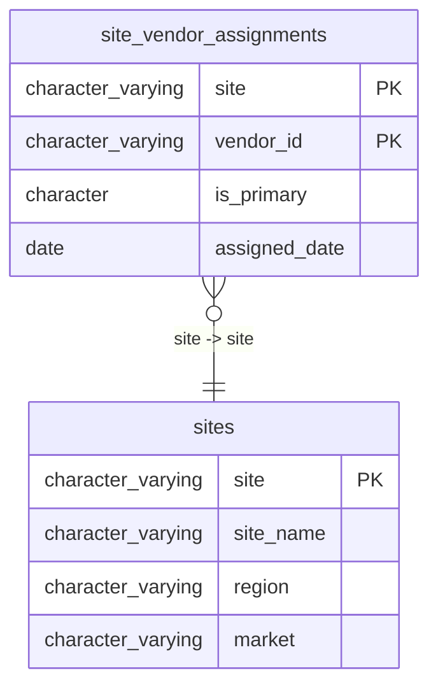

# sites

## Overview
The `sites` table serves as a master reference for physical locations within the organization, specifically capturing distribution centers. Each record links a unique site identifier to its descriptive name, geographic region, and local market city. This table likely acts as a foundational lookup for logistics, inventory, and regional reporting systems.

## Entity Relationship Diagram


## Column Reference Table
| Column | Type | Nullable | Default | Description |
|---|---|---|---|---|
| site | character varying(10) | No |  | Unique alphanumeric identifier for the specific physical location or facility. |
| site_name | character varying(100) | Yes |  | Human-readable description of the site, including its function or type. |
| region | character varying(50) | Yes |  | Broad geographic area designation where the site is located. |
| market | character varying(50) | Yes |  | Specific local market or city associated with the site's operations. |

## Business Rules
The following business rule is enforced at the database level:
- `sites_site_not_null`: The `site` column must not be null, ensuring every record has a valid identifier.

The following conventions are *inferred* from the sample data and are not enforced by database constraints:
- *Inferred*: The `site` column appears to use a zero-padded numeric format (e.g., "0091").
- *Inferred*: The `site_name` column follows a template format of "Site [ID] - [Type]", where the type is currently "Distribution Center".
- *Inferred*: The `region` and `market` columns describe a hierarchical geographic relationship, where the market (city) is contained within the broader region.

## Common Query Examples
Retrieve the name and region for a specific site ID.
```sql
SELECT site_name, region FROM sites WHERE site = '0091';
```

Get a distinct list of all regions where distribution centers are located.
```sql
SELECT DISTINCT region FROM sites;
```

Find all sites located in a specific market city.
```sql
SELECT site, site_name FROM sites WHERE market = 'Chicago';
```

List all sites in the 'Southeast' region ordered by their site ID.
```sql
SELECT site, site_name, market FROM sites WHERE region = 'Southeast' ORDER BY site;
```

## Index Documentation
The table has the following index:
- **sites_pkey**: A unique primary key index on the `site` column.

## Migration History
This database has no migration-tracking table (checked for alembic, flyway, django, knex, and sequelize conventions). Schema changes here are not currently tracked.

## Related
- [[relationships/site_vendor_assignments-sites]]
- [[relationships/overview]]
- [[domains/site-merchant-operations]]
- [[enums/site]]
- [[erd]]
- [[overview]]
- [[index]]
