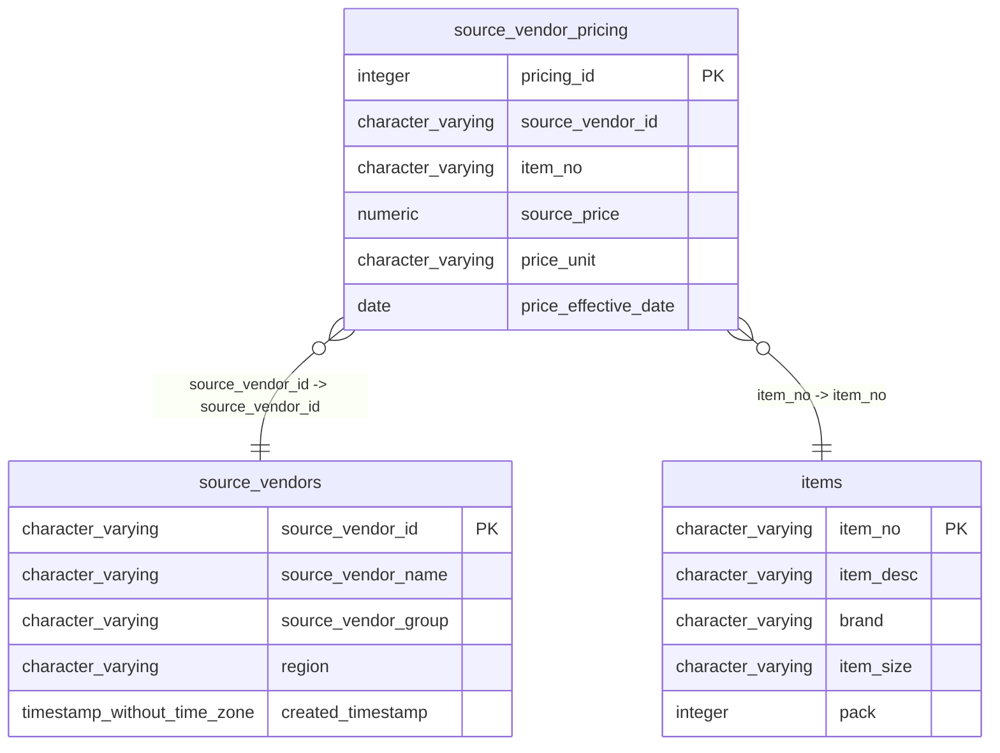

# source_vendor_pricing

## Overview
The `source_vendor_pricing` table stores the current price details for specific catalog items as supplied by various vendors. It serves as a pricing reference that links a vendor (`source_vendors`) and a product (`items`) to a specific monetary value and unit of measure. The `price_effective_date` column suggests the table may be used to track price changes over time, although it currently appears to function primarily as a static price list.

## Entity Relationship Diagram


## Column Reference Table
| Column | Type | Nullable | Default | Description |
|---|---|---|---|---|
| pricing_id | integer | No | nextval('source_vendor_pricing_pricing_id_seq'::regclass) | Unique system-generated identifier for each specific vendor pricing record. |
| source_vendor_id | character varying(20) | No |  | Primary key reference to the supplier providing this item quotation. |
| item_no | character varying(20) | No |  | Unique article number or part number assigned to the specific product. |
| source_price | numeric(10,4) | No |  | Unit price charged by the vendor for the specified item. |
| price_unit | character varying(10) | Yes | 'CS'::character varying | Measurement or packaging basis (e.g., Case) for the quoted price. |
| price_effective_date | date | No |  | Calendar date when this specific price agreement applies to orders. |

## Business Rules
The following database-level constraints enforce data integrity:
*   **`source_vendor_pricing_pricing_id_not_null`**: Ensures the primary key `pricing_id` cannot be null.
*   **`source_vendor_pricing_source_vendor_id_not_null`**: Ensures every pricing record is associated with a valid vendor ID.
*   **`source_vendor_pricing_item_no_not_null`**: Ensures every pricing record references a specific item number.
*   **`source_vendor_pricing_source_price_not_null`**: Ensures a price value must always be present.
*   **`source_vendor_pricing_price_effective_date_not_null`**: Ensures a specific effective date is recorded for the price.

The following conventions are *inferred* from the sample data (not enforced by the database):
*   Vendor IDs appear to follow a prefix format of "SV" followed by three digits (e.g., `SV00567`).
*   Item numbers appear to follow a prefix format of "SUPC-" followed by six digits (e.g., `SUPC-200002`).
*   `price_unit` is consistently "CS" (Case) in the provided samples.
*   `source_price` is stored with four decimal places.

## Common Query Examples
1. Get the current price for a specific item from all vendors.

```sql
SELECT 
    source_vendor_id,
    source_price,
    price_unit,
    price_effective_date
FROM source_vendor_pricing
WHERE item_no = 'SUPC-200002'
ORDER BY source_vendor_id;
```

2. Find the vendor offering the lowest price for a specific item.

```sql
SELECT 
    source_vendor_id,
    source_price
FROM source_vendor_pricing
WHERE item_no = 'SUPC-100001'
ORDER BY source_price ASC
LIMIT 1;
```

3. Retrieve full pricing details for a specific vendor.

```sql
SELECT 
    item_no,
    source_price,
    price_unit,
    price_effective_date
FROM source_vendor_pricing
WHERE source_vendor_id = 'SV00567';
```

4. Find all items priced above a certain threshold for a specific vendor.

```sql
SELECT 
    item_no,
    source_price
FROM source_vendor_pricing
WHERE source_vendor_id = 'SV00890'
  AND source_price > 11.00;
```

## Index Documentation
*   **`source_vendor_pricing_pkey`**
    *   **Columns**: `pricing_id`
    *   **Uniqueness**: Unique
    *   **Type**: Primary

*No other indexes are currently defined.* Given the likely query patterns of filtering by item and vendor, the following indexes would likely improve performance:
*   An index on `item_no` to quickly find all vendors pricing a specific item.
*   A composite index on `(source_vendor_id, item_no)` to quickly find the price for a specific item from a specific vendor.

## Migration History
This database has no migration-tracking table (checked for alembic, flyway, django, knex, and sequelize conventions). Schema changes here are not currently tracked.

## Related
- [[relationships/source_vendor_pricing-source_vendors]]
- [[relationships/source_vendor_pricing-items]]
- [[relationships/overview]]
- [[domains/pricing-procurement]]
- [[enums/price_unit]]
- [[erd]]
- [[overview]]
- [[index]]
