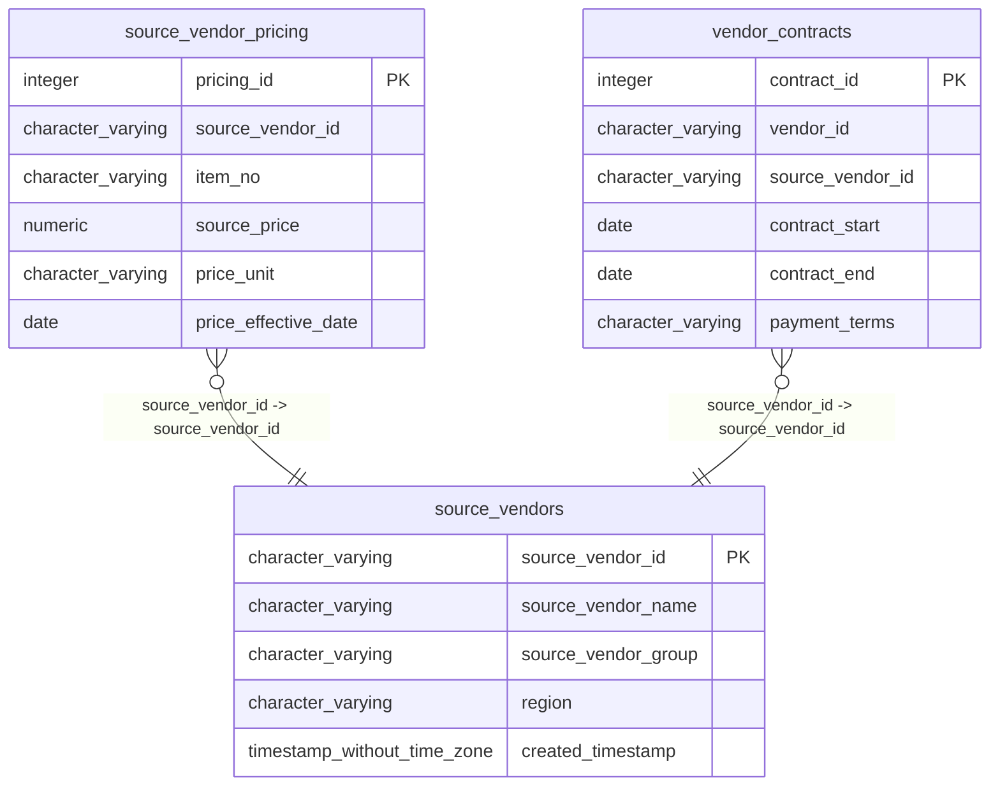

# source_vendors

## Overview
The `source_vendors` table stores reference data for external supply partners, identifying them by a unique vendor ID and name. It categorizes each vendor by a designated group (e.g., "Group A", "Group B") and geographical region, facilitating regional or group-based analysis of the supply chain. The presence of a `created_timestamp` allows for tracking when vendor records were established in the system.

## Entity Relationship Diagram


## Column Reference Table
| Column | Type | Nullable | Default | Description |
|---|---|---|---|---|
| source_vendor_id | character varying(20) | No |  | Unique alphanumeric identifier for each source vendor. |
| source_vendor_name | character varying(100) | No |  | The official business name of the source vendor. |
| source_vendor_group | character varying(50) | Yes |  | Categorical grouping assigned to the vendor for organizational management. |
| region | character varying(50) | Yes |  | Geographic market area where the vendor operates within the country. |
| created_timestamp | timestamp without time zone | Yes | now() | Date and time the vendor record was created in the system. |

## Business Rules
The database enforces the following check constraints:
- **`source_vendors_source_vendor_id_not_null`**: Ensures that `source_vendor_id` is never null, maintaining data integrity for the primary identifier.
- **`source_vendors_source_vendor_name_not_null`**: Ensures that `source_vendor_name` is never null, ensuring every vendor record has a descriptive name.

Additionally, the following conventions are inferred from the sample data but are not enforced at the database level:
- *Inferred*: `source_vendor_id` follows a specific format consisting of the prefix "SV" followed by a five-digit number (e.g., "SV00567").
- *Inferred*: `region` values appear to correspond to US geographic regions (e.g., "Midwest", "Northeast").
- *Inferred*: `source_vendor_group` values follow a "Group [Letter]" pattern (e.g., "Group A", "Group B").

## Common Query Examples
Find all vendors associated with "Group A".
```sql
SELECT source_vendor_id, source_vendor_name, region 
FROM source_vendors 
WHERE source_vendor_group = 'Group A';
```

Retrieve vendor details for a specific region.
```sql
SELECT * 
FROM source_vendors 
WHERE region = 'Midwest';
```

List all vendors created after a specific date.
```sql
SELECT source_vendor_id, source_vendor_name, created_timestamp 
FROM source_vendors 
WHERE created_timestamp > '2026-01-01 00:00:00';
```

Count the number of vendors per region.
```sql
SELECT region, COUNT(*) as vendor_count 
FROM source_vendors 
GROUP BY region 
ORDER BY vendor_count DESC;
```

## Index Documentation
The table includes the following indexes:
- **`source_vendors_pkey`**: Unique index on the column `source_vendor_id`. This serves as the primary key constraint.

No other indexes are present. Given the query examples above, particularly the filtering by `source_vendor_group` and `region`, it may be beneficial to create non-unique indexes on `source_vendor_group` and `region` if the table grows significantly large, although for a small reference table, a full table scan might be sufficiently fast.

## Migration History
This database has no migration-tracking table (checked for alembic, flyway, django, knex, and sequelize conventions). Schema changes here are not currently tracked.

## Related
- [[relationships/source_vendor_pricing-source_vendors]]
- [[relationships/vendor_contracts-source_vendors]]
- [[relationships/overview]]
- [[domains/pricing-procurement]]
- [[enums/source_vendor_group]]
- [[erd]]
- [[overview]]
- [[index]]
