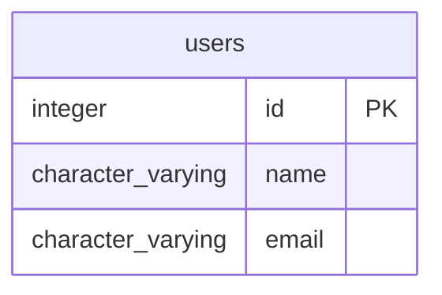

# users

## Overview
The `users` table serves as the primary registry for individual user accounts within the system, identified by a unique integer `id`. Each record stores essential user profile information, specifically the user's `name` and `email` address. Based on the sample data, this table appears to track basic identity attributes for platform users, though it currently lacks fields for authentication details or profile metadata.

## Entity Relationship Diagram


This table has no foreign-key relationships to other tables in the schema.

## Column Reference Table
| Column | Type | Nullable | Default | Description |
|---|---|---|---|---|
| id | integer | No | nextval('users_id_seq'::regclass) | Unique auto-generated integer identifier for each user record in the system. |
| name | character varying(100) | Yes |  | The user's full display name, such as first and last name. |
| email | character varying(100) | Yes |  | The unique email address used for authentication and communication. |

## Business Rules
The database enforces one check constraint:
- **users_id_not_null**: Ensures that the `id` column is never `NULL`, maintaining data integrity for the primary key.

The following conventions are *inferred* from the sample data and are not enforced at the database level:
- **Email Pattern**: Emails appear to follow the standard `name@example.com` format, suggesting a consistent naming convention for user accounts.
- **Name Case**: Names are stored in lowercase (e.g., "vijaya", "pandu"), indicating a potential normalization standard for user display names.
- **Unique Implied Data**: While not enforced by a foreign key or unique constraint besides the primary key, the sample data suggests `email` is intended to be unique per user, as is standard for user registries.

## Common Query Examples
Retrieve a specific user by their unique identifier:
```sql
SELECT id, name, email
FROM users
WHERE id = 1;
```

Find a user by their account name:
```sql
SELECT id, name, email
FROM users
WHERE name = 'vijaya';
```

List all users sorted by their name alphabetically:
```sql
SELECT id, name, email
FROM users
ORDER BY name ASC;
```

Count the total number of registered users:
```sql
SELECT COUNT(*) AS total_users
FROM users;
```

## Index Documentation
- **users_pkey**: A unique and primary index on the `id` column. This supports fast lookups by user ID, which is the primary key for the table.

## Migration History
This database has no migration-tracking table (checked for alembic, flyway, django, knex, and sequelize conventions). Schema changes here are not currently tracked.

## Related
This table has no foreign-key relationships to other tables in the schema.
- [[domains/web-data-user-access]]
- [[erd]]
- [[overview]]
- [[index]]
