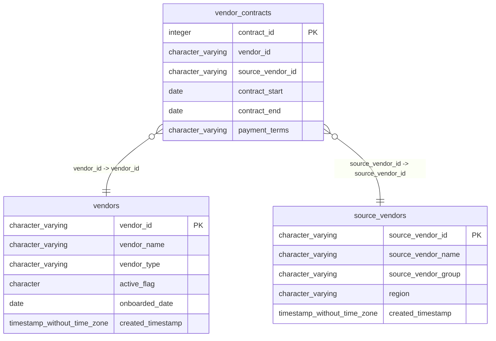

# vendor_contracts

## Overview
The `vendor_contracts` table tracks active and historical agreements between the organization and its external vendors. It links specific vendor entities (`vendor_id`) with their corresponding source identifiers (`source_vendor_id`) to manage contractual obligations. Key data points include the contract duration defined by `contract_start` and `contract_end`, as well as commercial terms such as `payment_terms`.

## Entity Relationship Diagram


## Column Reference Table
| Column | Type | Nullable | Default | Description |
|---|---|---|---|---|
| contract_id | integer | No | nextval('vendor_contracts_contract_id_seq'::regclass) | Unique identifier for the vendor contract record. |
| vendor_id | character varying(20) | No |  | Unique identifier for the primary vendor associated with this contract. |
| source_vendor_id | character varying(20) | Yes |  | Identifier for the vendor whose contract originated this current agreement. |
| contract_start | date | No |  | Date when this vendor contract became active. |
| contract_end | date | Yes |  | Date when this vendor contract expires or is terminated. |
| payment_terms | character varying(30) | Yes |  | Invoice payment schedule and terms agreed upon with the vendor. |

## Business Rules
The following check constraints enforce data integrity at the database level:
*   **`vendor_contracts_contract_id_not_null`**: Ensures that every record has a unique `contract_id`, preventing orphaned records without an identifier.
*   **`vendor_contracts_vendor_id_not_null`**: Requires that every contract be associated with a specific vendor in the `vendors` table.
*   **`vendor_contracts_contract_start_not_null`**: Mandates that every contract must have a defined start date, ensuring the timeline of the agreement is known.

*Inferred conventions* (not enforced by the database):
*   Vendor IDs appear to follow a prefix pattern, with `vendor_id` starting with "V" and `source_vendor_id` starting with "SV".
*   Payment terms are standardized as text values, with "Net 30" observed across all sample rows.

## Common Query Examples
Retrieve all contracts that are currently active based on the sample date range.
```sql
SELECT contract_id, vendor_id, payment_terms 
FROM vendor_contracts 
WHERE contract_start <= NOW() 
  AND (contract_end IS NULL OR contract_end >= NOW());
```

Find contracts expiring within the next 90 days to prepare for renewals.
```sql
SELECT contract_id, vendor_id, contract_end 
FROM vendor_contracts 
WHERE contract_end BETWEEN NOW() AND (NOW() + INTERVAL '90 days');
```

List all contracts for a specific vendor to review their total exposure.
```sql
SELECT contract_id, contract_start, contract_end, payment_terms 
FROM vendor_contracts 
WHERE vendor_id = 'V00234' 
ORDER BY contract_start DESC;
```

## Index Documentation
The table currently has the following indexes:
*   **`vendor_contracts_pkey`**: A unique primary key index on `contract_id`.

*Recommended indexes* (not present in current facts):
Given the query examples focusing on date ranges and vendor lookups, the following indexes would likely improve performance:
*   An index on `vendor_id` to speed up lookups for specific vendors.
*   An index on `contract_end` to optimize queries filtering for expiring or active contracts.

## Migration History
This database has no migration-tracking table (checked for alembic, flyway, django, knex, and sequelize conventions). Schema changes here are not currently tracked.

## Related
- [[relationships/vendor_contracts-vendors]]
- [[relationships/vendor_contracts-source_vendors]]
- [[relationships/overview]]
- [[domains/vendor-management]]
- [[queries/site-vendor-contract-details]] — Site vendor contract details
- [[erd]]
- [[overview]]
- [[index]]
