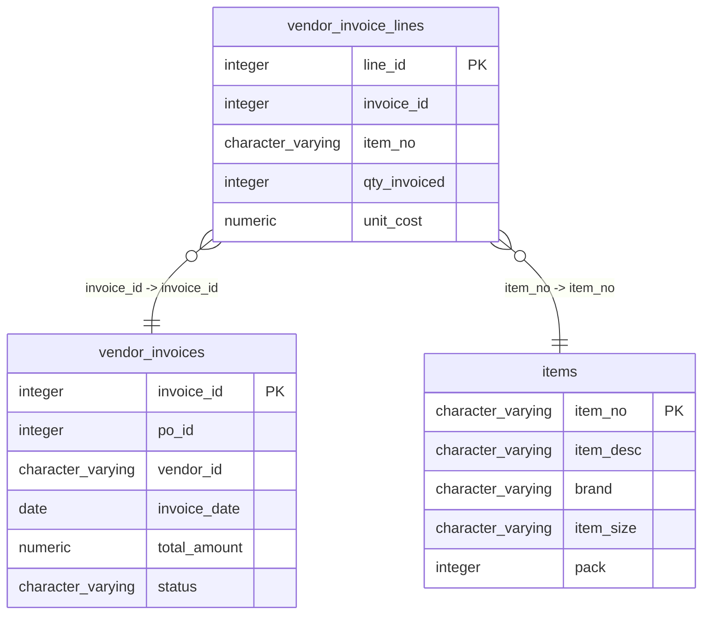

# vendor_invoice_lines

## Overview
The `vendor_invoice_lines` table is designed to store line item details for vendor invoices in a transactional system. Each row represents a unique line item associated with a specific invoice, including information on the item, quantity invoiced, and the cost per unit.

## Entity Relationship Diagram


## Column Reference Table
| Column | Type | Nullable | Default | Description |
|---|---|---|---|---|
| line_id | integer | No | nextval('vendor_invoice_lines_line_id_seq'::regclass) | Unique identifier for each invoice line item. |
| invoice_id | integer | No |  | Identifier for the associated invoice. |
| item_no | character varying(20) | No |  | Item number for the product invoiced. |
| qty_invoiced | integer | No |  | Quantity of the item that has been invoiced. |
| unit_cost | numeric(10,4) | No |  | Cost per unit of the item invoiced. |

## Business Rules
The table enforces several business rules at the database level via check constraints:
- `line_id`, `invoice_id`, `item_no`, `qty_invoiced`, and `unit_cost` cannot be null, ensuring that all line items have essential identifying and financial information.
  
*Inferred conventions from the sample data include:*
- Each ` invoice_id` can have multiple `line_id`s, indicating one invoice may include multiple line items.
- The `item_no` for different line items on the same invoice may or may not be unique.
- `qty_invoiced` appears as a positive integer, reflecting that negative quantities are not logically applicable in this context.
- `unit_cost` values are formatted as numeric, suggesting a focus on precision in financial calculations.

## Common Query Examples
```sql
-- Retrieve all line items for a specific invoice
SELECT * FROM vendor_invoice_lines WHERE invoice_id = 1;
```
```sql
-- Calculate total cost for line items in a specific invoice
SELECT SUM(qty_invoiced * unit_cost) AS total_cost FROM vendor_invoice_lines WHERE invoice_id = 2;
```
```sql
-- Find all items with a unit cost greater than a specified amount
SELECT * FROM vendor_invoice_lines WHERE unit_cost > 10.00;
```
```sql
-- Count the number of line items invoiced for each item number
SELECT item_no, COUNT(*) AS number_of_lines FROM vendor_invoice_lines GROUP BY item_no;
```

## Index Documentation
- **vendor_invoice_lines_pkey**: Unique index on `line_id` (Primary Key) - ensures each line item is uniquely identifiable.

No additional indexes are defined. However, it might be beneficial to create indexes on `invoice_id` and `item_no` to improve query performance for lookups and joins involving these columns, especially given their frequent use in the common query examples.

## Migration History
This database has no migration-tracking table (checked for alembic, flyway, django, knex, and sequelize conventions). Schema changes here are not currently tracked.

## Related
- [[relationships/vendor_invoice_lines-vendor_invoices]]
- [[relationships/vendor_invoice_lines-items]]
- [[relationships/overview]]
- [[domains/pricing]]
- [[erd]]
- [[overview]]
- [[index]]
