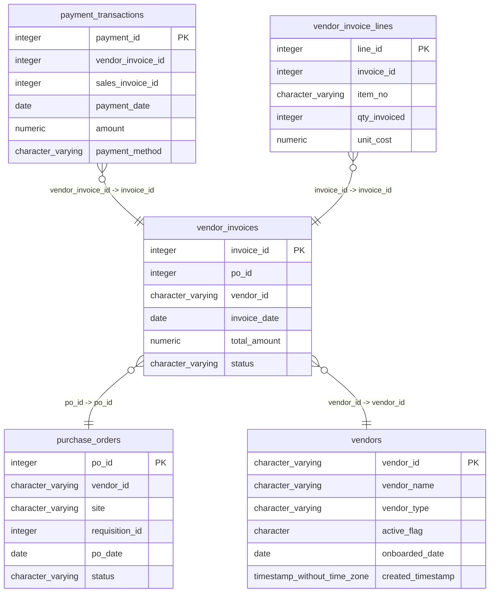

# vendor_invoices

## Overview
The `vendor_invoices` table captures details of invoices issued by vendors for corresponding purchase orders. It includes essential fields such as invoice ID, purchase order ID, vendor ID, invoice date, total amount, and status, enabling efficient tracking and management of financial transactions.

## Entity Relationship Diagram


## Column Reference Table
| Column | Type | Nullable | Default | Description |
|---|---|---|---|---|
| invoice_id | integer | No | nextval('vendor_invoices_invoice_id_seq'::regclass) | Unique identifier for each vendor invoice. |
| po_id | integer | No |  | Purchase order identifier associated with the invoice. |
| vendor_id | character varying(20) | No |  | Identifier for the vendor who issued the invoice. |
| invoice_date | date | No |  | Date the invoice was issued. |
| total_amount | numeric(12,2) | Yes |  | Total monetary amount of the invoice. |
| status | character varying(20) | Yes | 'Unpaid'::character varying | Current payment status of the invoice. |

## Business Rules
The following check constraints are enforced at the database level:
- `vendor_invoices_invoice_id_not_null`: Ensures that the `invoice_id` cannot be NULL.
- `vendor_invoices_po_id_not_null`: Ensures that the `po_id` cannot be NULL.
- `vendor_invoices_vendor_id_not_null`: Ensures that the `vendor_id` cannot be NULL.
- `vendor_invoices_invoice_date_not_null`: Ensures that the `invoice_date` cannot be NULL.

*Inferred conventions observed in the sample data:*
- Each invoice is associated with a unique `invoice_id`.
- The `total_amount` field appears to be formatted consistently as a numeric value.
- The `status` field reflects the payment status, with values like "Paid" and "Unpaid".

## Common Query Examples
Retrieve all invoices with their details, ordered by invoice date:
```sql
SELECT * FROM vendor_invoices
ORDER BY invoice_date;
```

Count the number of unpaid invoices:
```sql
SELECT COUNT(*) FROM vendor_invoices
WHERE status = 'Unpaid';
```

Find total amounts of all paid invoices:
```sql
SELECT SUM(total_amount) FROM vendor_invoices
WHERE status = 'Paid';
```

Get the invoice details for a specific vendor:
```sql
SELECT * FROM vendor_invoices
WHERE vendor_id = 'V00234';
```

## Index Documentation
- `vendor_invoices_pkey`: This index is on the `invoice_id` column and is unique, serving as the primary key for the table.

Since there is only the primary key index, it may be beneficial to create additional indexes on the `po_id` and `vendor_id` columns. For example:
- An index on `po_id` could optimize queries filtering by purchase orders.
- An index on `vendor_id` could improve performance for searching invoices by vendor.

## Migration History
This database has no migration-tracking table (checked for alembic, flyway, django, knex, and sequelize conventions). Schema changes here are not currently tracked.

## Related
- [[relationships/payment_transactions-vendor_invoices]]
- [[relationships/vendor_invoice_lines-vendor_invoices]]
- [[relationships/vendor_invoices-purchase_orders]]
- [[relationships/vendor_invoices-vendors]]
- [[relationships/overview]]
- [[domains/order-management]]
- [[enums/status]]
- [[queries/vendor-invoices-payment-transactions]] — Vendor invoices with payment transactions
- [[queries/purchase-orders-assoc-invoices]] — Purchase Orders Associated with Invoices
- [[erd]]
- [[overview]]
- [[index]]
