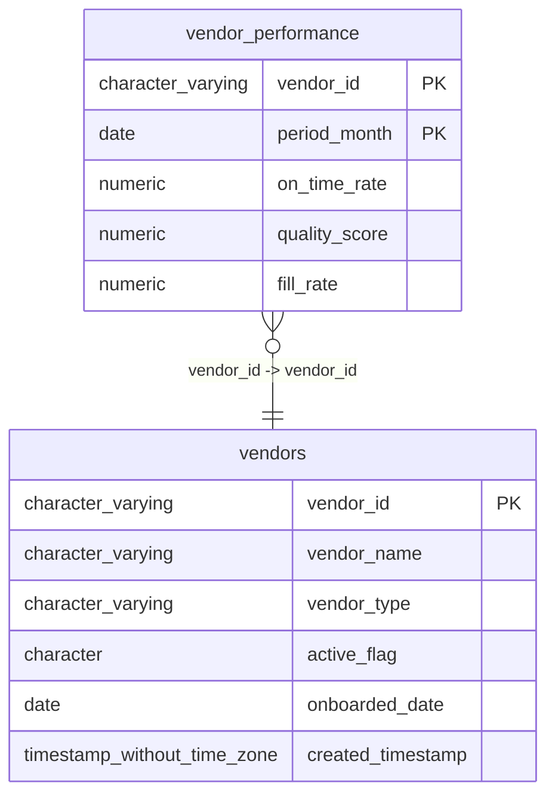

# vendor_performance

## Overview
The `vendor_performance` table stores monthly KPI metrics for individual vendors, tracking delivery reliability and quality. It tracks three specific performance indicators: `on_time_rate`, `quality_score`, and `fill_rate` for a given `vendor_id` and `period_month`. The data structure suggests this table is used for longitudinal analysis of vendor reliability over time, allowing for month-over-month comparisons.

## Entity Relationship Diagram


## Column Reference Table
| Column | Type | Nullable | Default | Description |
|---|---|---|---|---|
| vendor_id | character varying(20) | No |  | Unique identifier for the vendor associated with the performance record. |
| period_month | date | No |  | Specific month for which the vendor performance metrics are reported. |
| on_time_rate | numeric(5,2) | Yes |  | Percentage of orders delivered on or before the promised date. |
| quality_score | numeric(5,2) | Yes |  | Measure of product quality based on defect rates or inspections. |
| fill_rate | numeric(5,2) | Yes |  | Percentage of requested order quantity successfully fulfilled by the vendor. |

## Business Rules
The following check constraints are enforced at the database level:
- **`vendor_performance_vendor_id_not_null`**: Ensures that every performance record is associated with a valid vendor ID; the `vendor_id` column cannot be NULL.
- **`vendor_performance_period_month_not_null`**: Ensures that every performance record is associated with a specific time period; the `period_month` column cannot be NULL.

## Common Query Examples
Retrieve the most recent month's performance metrics for a specific vendor.
```sql
SELECT vendor_id, period_month, on_time_rate, quality_score, fill_rate
FROM vendor_performance
WHERE vendor_id = 'V00234'
ORDER BY period_month DESC
LIMIT 1;
```

Identify vendors that have missed the 95% on-time delivery rate threshold in the last quarter.
```sql
SELECT vendor_id, period_month, on_time_rate
FROM vendor_performance
WHERE period_month >= '2025-04-01'
  AND period_month < '2025-07-01'
  AND on_time_rate < 95.00;
```

Calculate the average quality score for a vendor across all recorded months.
```sql
SELECT vendor_id, AVG(quality_score) AS avg_quality
FROM vendor_performance
WHERE vendor_id = 'V00234'
GROUP BY vendor_id;
```

Analyze the trend in fill rates for a specific month across all vendors.
```sql
SELECT vendor_id, fill_rate
FROM vendor_performance
WHERE period_month = '2025-06-01'
ORDER BY fill_rate DESC;
```

## Index Documentation
The table utilizes the following primary key index to ensure uniqueness and facilitate rapid lookups:
- **`vendor_performance_pkey`**: A unique primary key index composed of the columns `vendor_id` and `period_month`. This ensures that there is only one performance record per vendor per month and supports efficient retrieval of data filtered by vendor and/or period.

## Migration History
This database has no migration-tracking table (checked for alembic, flyway, django, knex, and sequelize conventions). Schema changes here are not currently tracked.

## Related
- [[relationships/vendor_performance-vendors]]
- [[relationships/overview]]
- [[domains/vendor-management]]
- [[queries/site-vendor-performance-metrics]] — Site vendor performance metrics
- [[erd]]
- [[overview]]
- [[index]]
