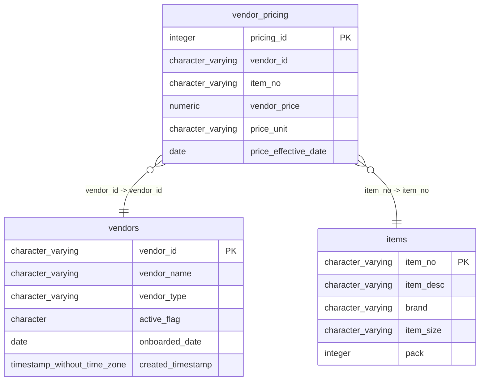

# vendor_pricing

## Overview
The `vendor_pricing` table stores historical and current price points for specific items sourced from specific vendors. By linking `vendor_id` and `item_no`, it captures the cost structure of purchasing inventory, including the unit of measure (`price_unit`) and the validity period (`price_effective_date`). This data supports procurement planning and cost analysis by recording how supplier prices change over time.

## Entity Relationship Diagram


## Column Reference Table
| Column | Type | Nullable | Default | Description |
|---|---|---|---|---|
| pricing_id | integer | No | nextval('vendor_pricing_pricing_id_seq'::regclass) | Unique internal identifier for each vendor pricing record in the system. |
| vendor_id | character varying(20) | No |  | Identifier referencing the company supplying the goods and providing the price. |
| item_no | character varying(20) | No |  | Code representing the specific product or material associated with the pricing entry. |
| vendor_price | numeric(10,4) | No |  | The monetary amount charged by the vendor for the specified product unit. |
| price_unit | character varying(10) | Yes | 'CS'::character varying | Measurement basis (e.g., case) for which the vendor price is calculated. |
| price_effective_date | date | No |  | Calendar date when the specified vendor price becomes valid for transactions. |

## Business Rules
The database enforces the following integrity constraints:
- **`vendor_pricing_pricing_id_not_null`**: Ensures every record has a unique identifier.
- **`vendor_pricing_vendor_id_not_null`**: Prevents pricing records without an associated vendor.
- **`vendor_pricing_item_no_not_null`**: Ensures every price is linked to a specific item.
- **`vendor_pricing_vendor_price_not_null`**: Guarantees that a price value is always present.
- **`vendor_pricing_price_effective_date_not_null`**: Requires a date to define when the price becomes active, supporting time-based price history queries.

## Common Query Examples
Get the most current price for a specific item from a specific vendor.
```sql
SELECT *
FROM vendor_pricing
WHERE vendor_id = 'V00234'
  AND item_no = 'SUPC-200002'
ORDER BY price_effective_date DESC
LIMIT 1;
```

Find all price changes for a specific vendor within the last year.
```sql
SELECT vendor_id, item_no, vendor_price, price_effective_date
FROM vendor_pricing
WHERE vendor_id = 'V00234'
  AND price_effective_date >= CURRENT_DATE - INTERVAL '1 year'
ORDER BY price_effective_date;
```

List distinct items shared between two vendors with their respective current prices.
```sql
SELECT 
    p1.item_no,
    v1.vendor_id AS vendor_1_id,
    p1.vendor_price AS price_1,
    v2.vendor_id AS vendor_2_id,
    p2.vendor_price AS price_2
FROM vendor_pricing p1
JOIN vendor_pricing p2 ON p1.item_no = p2.item_no
WHERE p1.vendor_id = 'V00234'
  AND p2.vendor_id = 'V00345'
  AND p1.price_effective_date = (
      SELECT MAX(price_effective_date) FROM vendor_pricing WHERE vendor_id = 'V00234' AND item_no = p1.item_no
  )
  AND p2.price_effective_date = (
      SELECT MAX(price_effective_date) FROM vendor_pricing WHERE vendor_id = 'V00345' AND item_no = p2.item_no
  );
```

## Index Documentation
- **`vendor_pricing_pkey`**: Unique index on `pricing_id` (Primary Key).

**Suggested Additional Indexes:**
Given that the table likely grows as new price points are added over time, and queries frequently filter by vendor and item to find the latest price, the following index would improve performance:
- **Composite Index**: `CREATE INDEX idx_vendor_pricing_vendor_item_date ON vendor_pricing (vendor_id, item_no, price_effective_date DESC);`
  *Rationale*: This supports the common pattern of finding the most recent price for a specific vendor-item combination by allowing the database to quickly locate the relevant rows and retrieve the latest entry.

## Migration History
This database has no migration-tracking table (checked for alembic, flyway, django, knex, and sequelize conventions). Schema changes here are not currently tracked.

## Related
- [[relationships/vendor_pricing-items]]
- [[relationships/vendor_pricing-vendors]]
- [[relationships/overview]]
- [[domains/pricing-procurement]]
- [[enums/price_unit]]
- [[queries/site-vendor-pricing-snapshot]] — Site vendor pricing snapshot
- [[erd]]
- [[overview]]
- [[index]]
