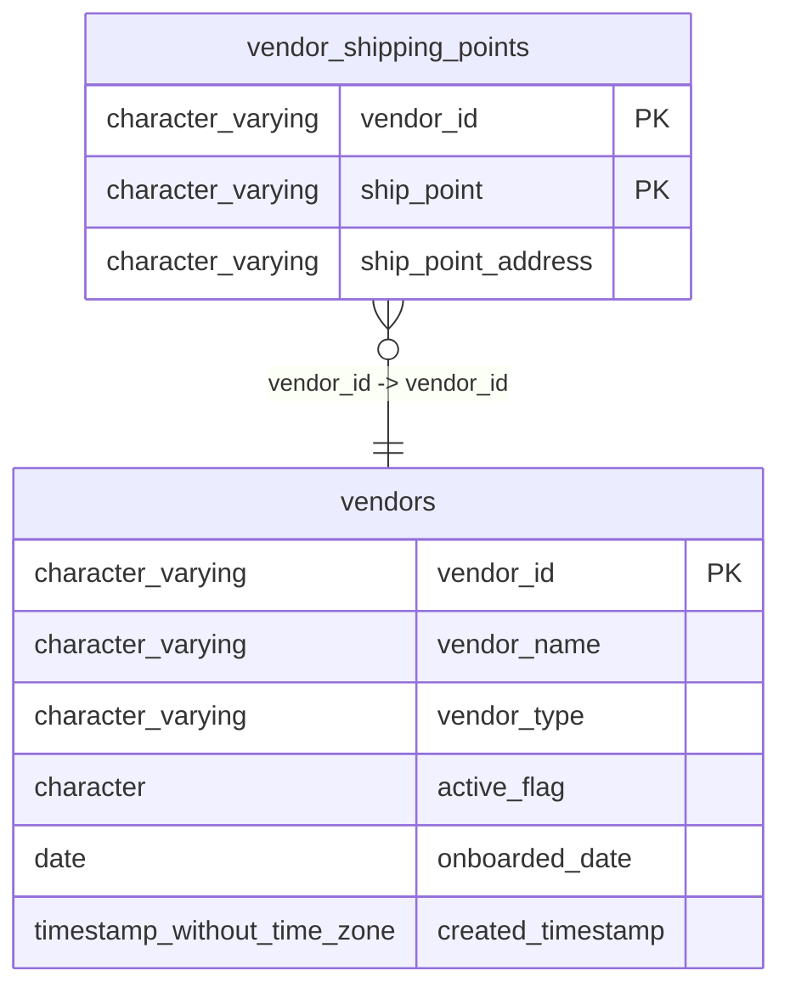

# vendor_shipping_points

## Overview
The `vendor_shipping_points` table defines the specific shipping destinations or locations associated with a given vendor. It links vendor identities to unique shipping point identifiers and their corresponding physical addresses. This structure supports logistics operations by maintaining a registry of where goods can be dispatched for each vendor.

## Entity Relationship Diagram


## Column Reference Table
| Column | Type | Nullable | Default | Description |
|---|---|---|---|---|
| vendor_id | character varying(20) | No |  | Unique identifier for the associated vendor in the system. |
| ship_point | character varying(20) | No |  | Code identifying a specific shipping location or dock. |
| ship_point_address | character varying(200) | Yes |  | Physical address or description of the shipping point. |

## Business Rules
The following check constraints are enforced at the database level to ensure data integrity:
1.  **`vendor_shipping_points_vendor_id_not_null`**: Enforces that `vendor_id IS NOT NULL`. This ensures every shipping point is associated with a valid vendor identifier.
2.  **`vendor_shipping_points_ship_point_not_null`**: Enforces that `ship_point IS NOT NULL`. This ensures every record provides a specific shipping point identifier.

No other business rules (such as format validations for addresses) are enforced at the database level based on the provided constraints.

## Common Query Examples
Retrieve the shipping address for a specific vendor and shipping point.
```sql
SELECT ship_point_address
FROM vendor_shipping_points
WHERE vendor_id = 'V00234' AND ship_point = 'SP-234-01';
```

List all shipping points and addresses associated with a specific vendor.
```sql
SELECT ship_point, ship_point_address
FROM vendor_shipping_points
WHERE vendor_id = 'V00234';
```

Find all vendors that have a specific shipping point code.
```sql
SELECT DISTINCT vendor_id
FROM vendor_shipping_points
WHERE ship_point = 'SP-567-01';
```

## Index Documentation
The table has the following index:
-   **`vendor_shipping_points_pkey`**: Primary key index on columns `vendor_id` and `ship_point`. This index enforces the uniqueness of the composite primary key and allows for efficient lookups based on vendor or shipping point combinations.

## Migration History
This database has no migration-tracking table (checked for alembic, flyway, django, knex, and sequelize conventions). Schema changes here are not currently tracked.

## Related
- [[relationships/vendor_shipping_points-vendors]]
- [[relationships/overview]]
- [[domains/vendor-management]]
- [[queries/site-vendor-shipping-addresses]] — Site vendor shipping addresses
- [[erd]]
- [[overview]]
- [[index]]
