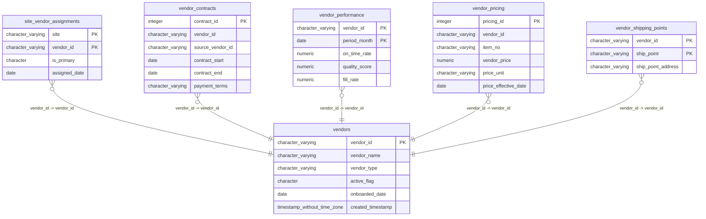

# vendors

## Overview
The `vendors` table stores master data regarding the organization's external vendors, capturing both identity details and operational status. It tracks key attributes such as the vendor's name, classification (e.g., Primary), and current activity level via an active flag. Additionally, it maintains temporal records including when a vendor was first onboarded and when the record was created in the system.

## Entity Relationship Diagram


## Column Reference Table
| Column | Type | Nullable | Default | Description |
|---|---|---|---|---|
| vendor_id | character varying(20) | No |  | Unique alphanumeric identifier for the vendor record, serving as the primary key. |
| vendor_name | character varying(100) | No |  | The full legal or trading name of the vendor entity. |
| vendor_type | character varying(30) | Yes |  | Categorizes the vendor relationship, such as Primary or Secondary, for reporting purposes. |
| active_flag | character(1) | Yes | 'Y'::bpchar | Boolean indicator showing whether the vendor is currently active or inactive in the system. |
| onboarded_date | date | Yes |  | The specific date the vendor was first registered and approved in the system. |
| created_timestamp | timestamp without time zone | Yes | now() | System-generated timestamp recording the exact time the record was initially inserted. |

## Business Rules
The following constraints are enforced at the database level:
*   **`vendors_vendor_id_not_null`**: Ensures that the `vendor_id` column cannot be null, guaranteeing a unique identifier exists for every record.
*   **`vendors_vendor_name_not_null`**: Ensures that the `vendor_name` column cannot be null, requiring every vendor record to have a descriptive name.

No foreign keys are defined on this table, indicating it serves as a standalone reference table.

## Common Query Examples
Retrieve all active vendors of type "Primary" who were onboarded in 2020:
```sql
SELECT vendor_id, vendor_name, onboarded_date
FROM vendors
WHERE active_flag = 'Y'
  AND vendor_type = 'Primary'
  AND onboarded_date BETWEEN '2020-01-01' AND '2020-12-31';
```

List inactive vendors that have not been active since the current date, ordered by name:
```sql
SELECT vendor_id, vendor_name, onboarded_date
FROM vendors
WHERE active_flag = 'N'
ORDER BY vendor_name ASC;
```

Count the total number of vendors grouped by their vendor type:
```sql
SELECT vendor_type, COUNT(*) as vendor_count
FROM vendors
GROUP BY vendor_type
ORDER BY vendor_count DESC;
```

## Index Documentation
*   **`vendors_pkey`**: Primary key index on `vendor_id`. This is unique and used to enforce the primary key constraint, enabling fast lookups by vendor ID.

*No other indexes are present.* Given the absence of indexes on `active_flag`, `vendor_type`, or `onboarded_date`, queries filtering by these columns (as seen in the examples above) would result in full table scans. If the table grows significantly, adding a composite index on `(active_flag, vendor_type)` or a separate index on `onboarded_date` would likely improve query performance.

## Migration History
This database has no migration-tracking table (checked for alembic, flyway, django, knex, and sequelize conventions). Schema changes here are not currently tracked.

## Related
- [[relationships/site_vendor_assignments-vendors]]
- [[relationships/vendor_contracts-vendors]]
- [[relationships/vendor_performance-vendors]]
- [[relationships/vendor_pricing-vendors]]
- [[relationships/vendor_shipping_points-vendors]]
- [[relationships/overview]]
- [[domains/vendor-management]]
- [[enums/vendor_type]]
- [[enums/active_flag]]
- [[queries/site-vendor-contract-details]] — Site vendor contract details
- [[queries/site-vendor-performance-metrics]] — Site vendor performance metrics
- [[queries/site-vendor-pricing-snapshot]] — Site vendor pricing snapshot
- [[queries/site-vendor-shipping-addresses]] — Site vendor shipping addresses
- [[erd]]
- [[overview]]
- [[index]]
