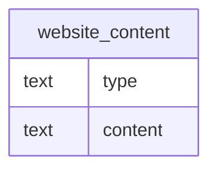

# website_content

## Overview
The `website_content` table stores textual components of a website, likely for simple static site generation or content management. Each record holds a specific type of content element (such as headings or paragraphs) and its corresponding text payload. Given the sample data, this table appears to persist structured parts of a web page rather than the entire page as a single blob.

## Entity Relationship Diagram


This table has no foreign-key relationships to other tables in the schema.

## Column Reference Table
| Column | Type | Nullable | Default | Description |
|---|---|---|---|---|
| type | text | Yes |  | Categorical label indicating the HTML element or content format of the row. |
| content | text | Yes |  | The actual text data associated with the specific content type. |

## Business Rules
No business rules are enforced at the database level, as no check constraints are defined. The following conventions are observed in the sample data but are not enforced by the schema:

*   *Inferred*: The `type` column uses human-readable labels with initial capitalization (e.g., "Heading", "Paragraph").
*   *Inferred*: The `content` column stores plain text or markup free of surrounding whitespace padding, though trimming may depend on application logic.
*   *Inferred*: Records represent discrete sections of a page, implying an external ordering mechanism (such as a separate ID or application-level sorting) is used to determine display sequence, as no explicit order column exists.

## Common Query Examples
Retrieve the content for all paragraphs on the site.
```sql
SELECT content FROM website_content WHERE type = 'Paragraph';
```

Fetch the first heading used on the site.
```sql
SELECT content FROM website_content WHERE type = 'Heading' LIMIT 1;
```

List all unique content types currently stored.
```sql
SELECT DISTINCT type FROM website_content;
```

Check if any content element is empty.
```sql
SELECT COUNT(*) FROM website_content WHERE content IS NULL OR content = '';
```

## Index Documentation
No indexes are currently defined on this table. Given the small dataset size (estimated row count is ambiguous but likely small given the lack of indices) and the simple schema, performance may not be a critical concern yet. However, if query volume increases, the following indexes would be beneficial:

*   An index on `type` would speed up filtered retrieval of specific content elements (e.g., all headings).
*   Since there is no primary key or unique identifier, adding a unique index on a new explicit ID column (if added in the future) is standard practice, but based strictly on existing columns, an index on `type` is the most logical optimization for the queries above.

## Migration History
This database has no migration-tracking table (checked for alembic, flyway, django, knex, and sequelize conventions). Schema changes here are not currently tracked.

## Related
This table has no foreign-key relationships to other tables in the schema.
- [[domains/web-data-user-access]]
- [[enums/type]]
- [[erd]]
- [[overview]]
- [[index]]
