# Full Schema ERD

## Summary
Full entity-relationship diagram for all 14 tables and 10 foreign-key relationships in the live schema — a single-glance mental model before diving into individual entity pages.

## Evidence

```mermaid
erDiagram
    items {
        character_varying item_no PK
        character_varying item_desc
        character_varying brand
        character_varying item_size
        integer pack
    }
    llm_scraped_books {
        text title
        text price
        text availability
        text upc
        text product_type
    }
    scraped_web_elements {
        text element_type
        text parent_section
        text primary_content
        text secondary_content
    }
    site_vendor_assignments {
        character_varying site PK
        character_varying vendor_id PK
        character is_primary
        date assigned_date
    }
    sites {
        character_varying site PK
        character_varying site_name
        character_varying region
        character_varying market
    }
    source_vendor_pricing {
        integer pricing_id PK
        character_varying source_vendor_id
        character_varying item_no
        numeric source_price
        character_varying price_unit
        date price_effective_date
    }
    source_vendors {
        character_varying source_vendor_id PK
        character_varying source_vendor_name
        character_varying source_vendor_group
        character_varying region
        timestamp_without_time_zone created_timestamp
    }
    users {
        integer id PK
        character_varying name
        character_varying email
    }
    vendor_contracts {
        integer contract_id PK
        character_varying vendor_id
        character_varying source_vendor_id
        date contract_start
        date contract_end
        character_varying payment_terms
    }
    vendor_performance {
        character_varying vendor_id PK
        date period_month PK
        numeric on_time_rate
        numeric quality_score
        numeric fill_rate
    }
    vendor_pricing {
        integer pricing_id PK
        character_varying vendor_id
        character_varying item_no
        numeric vendor_price
        character_varying price_unit
        date price_effective_date
    }
    vendor_shipping_points {
        character_varying vendor_id PK
        character_varying ship_point PK
        character_varying ship_point_address
    }
    vendors {
        character_varying vendor_id PK
        character_varying vendor_name
        character_varying vendor_type
        character active_flag
        date onboarded_date
        timestamp_without_time_zone created_timestamp
    }
    website_content {
        text type
        text content
    }
    site_vendor_assignments }o--|| sites : "site -> site"
    site_vendor_assignments }o--|| vendors : "vendor_id -> vendor_id"
    source_vendor_pricing }o--|| source_vendors : "source_vendor_id -> source_vendor_id"
    source_vendor_pricing }o--|| items : "item_no -> item_no"
    vendor_contracts }o--|| vendors : "vendor_id -> vendor_id"
    vendor_contracts }o--|| source_vendors : "source_vendor_id -> source_vendor_id"
    vendor_performance }o--|| vendors : "vendor_id -> vendor_id"
    vendor_pricing }o--|| items : "item_no -> item_no"
    vendor_pricing }o--|| vendors : "vendor_id -> vendor_id"
    vendor_shipping_points }o--|| vendors : "vendor_id -> vendor_id"
```

## Related
- [[index]]
- [[relationships/overview]]
